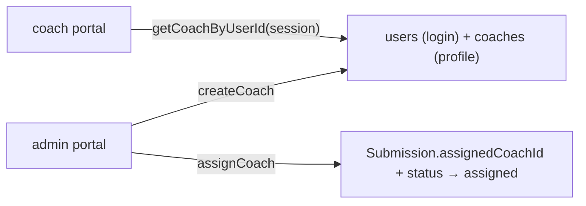

# coach — `src/domains/coach/`

The **coach domain slice** — the people who review submissions, and the admin verbs for
managing them and assigning work.

---

## 1 · The northstar

A `Coach` is a reviewer's profile (name, specialties, languages, active) **plus a login** —
the `coaches` row is keyed to a `users` row by `userId`. the admin creates coaches from the admin
portal (there is no self-signup) and assigns each submission to one.

### The invariants

- **A coach is two rows, made together.** `createCoach` calls the account domain's
  `createOperator` for the login, then inserts the `coaches` profile — one is useless without
  the other.
- **Both verbs are admin-only**, re-checked with `requireRole("admin")` in the server action,
  never trusted from the UI.
- **Assignment moves the status to `assigned`** — one call, so the queue state and the
  ownership can't disagree.
- **The coach portal finds *its* coach by the session's `userId`**, never by a client-supplied
  id.

### The pieces

- `api/coachApi.ts` — `listCoaches`, `getCoachByUserId`, `createCoach` (the only `coaches`
  reader/writer).
- `api/coachActions.ts` — `createCoachAction`, `assignCoachAction` (server actions).
- `ui/AddCoachForm.tsx` — the admin's add-coach form.
- `model/coach.ts` — `Coach`, `NewCoach`.

---

## 2b · Fixed 2026-08-02

- 🔴 **The hand-off refused translated submissions.** `notifyCoachAction` only
  accepted `assigned`, but a translated intake sits at `intake_translated` — so
  the button appeared, the action returned, and nothing happened. Silently, for
  exactly the submissions that needed translating. Found by simulation, not by
  review.

## 2 · Where we are now — 2026-08-01

**Phases 3–4 of the rollout landed here.**

- ✅ **The hand-off stops at `sent_to_coach`.** Emailing a coach is not the same
  as a coach starting work, and the gap between them is the one place a
  submission stalls on a person outside the building. the admin can now see it.
- ✅ **`noteCoachCollected`** — the coach's first download earns `in_review` and
  tells the admin the hand-off closed. Gated on it being **that coach's** submission:
  the download route can only see that *a* coach is logged in, and an admin
  checking on the work must not count as the coach starting it.
  Fire-and-forget and self-swallowing, because it hangs off a route whose real
  job is delivering bytes.
- ✅ **`coaches.languages` is one half of the translation rule.** The rule itself
  lives in `domains/submission`, because it needs both halves: a submission needs
  translating exactly when the customer's declared languages and this coach's
  **share nothing**. English is no longer privileged — a Japanese-reading parent
  paired with a Japanese-reading coach needs no translation, which the old
  coach-only derivation got wrong.
  **Unknown is not the same as no**: either side blank returns `null`, and the
  queue names *which* side is blank, since the fix differs.
- ✅ **The hand-off carries a language choice** (step 8's radio) and records what
  was actually sent. The radio can't live on assignment — at that point the
  translation doesn't exist to choose.
- ✅ **Reassignment is guarded server-side**, not just hidden: a stale tab could
  previously pull a submission out from under a coach who had already been
  emailed it.
- ✅ **Languages are a radio choice — Japanese · English · Both**, defaulting to
  Japanese, on both the add and edit forms. It replaces a comma-separated text
  box that could be **left empty**, and empty is the one input the translation
  rule can't answer: it returns `null` and the queue reports "no languages
  recorded" instead of routing the submission. One option is always selected, so
  that state is now unreachable from the form — and `readLanguageChoice` falls
  back to the default server-side, so it's unreachable from a tampered post too.
  **Both is a real answer, not a convenience**: a bilingual coach reads whatever
  the customer declared.
  The cost is that a third language now needs a code change rather than typing
  it into a box. Worth it while `LANGUAGES` is two — revisit it when it isn't.
- ✅ **Existing coaches were backfilled to English** (migration `0014`). Every
  coach on record predates the question and every one of them reads English —
  that was the platform's own assumption until the intersection replaced it.
  Only blank rows are touched, so it can't undo a coach deliberately set to
  Japanese only.
  **`submissions.languages` is deliberately *not* backfilled**: a coach's
  profile is the admin's to state, a customer's declaration is not ours to invent.
- ✅ **The dev seed carries all three language shapes** — bilingual, Japanese
  only, English only. The bilingual one is the case worth having: a rule written
  as "do the sets match?" instead of "do they overlap?" passes both
  single-language coaches and fails only there.

### Before 2026-08-01

- ✅ **Create a coach** from `/admin/coaches` — login + profile, specialties, languages.
- ✅ **Assign a coach** to a submission from the admin queue, moving it to `assigned`.
- ✅ **`getCoachByUserId`** backs the coach portal's "my assigned submissions" view.
- ✅ **Edit a coach** at `/admin/coaches/[id]` — name, specialties, languages, and the
  `isActive` toggle (an inactive coach still shows in the assign dropdown; hiding them there
  is a small follow-up).
- 🔶 **No delete** — a coach can be deactivated but not removed (their assignments would
  orphan). Reassignment is by picking a different coach on the queue.

---

## 3 · Where we came from

**2026-07-29 · Created with the operator portal** ([ADR 007](../../../docs/decisions/007-portal-and-postgres-retire-airtable.md)).
Under Airtable, "Assigned Coach" was a free-text field the admin typed into and there was no coach
concept in code. The portal made coaches real: a login, a profile, and referential
integrity via `assignedCoachId`.
