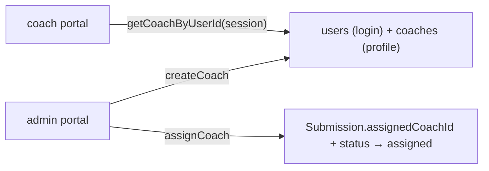

# coach — `src/domains/coach/`

The **coach domain slice** — the people who review submissions, and the admin verbs for
managing them and assigning work.

---

## 1 · The northstar

A `Coach` is a reviewer's profile (name, specialties, languages, active) **plus a login** —
the `coaches` row is keyed to a `users` row by `userId`. Yuta creates coaches from the admin
portal (there is no self-signup) and assigns each submission to one.

### The invariants

- **A coach is two rows, made together.** `createCoach` calls the account domain's
  `createOperator` for the login, then inserts the `coaches` profile — one is useless without
  the other.
- **Both verbs are admin-only**, re-checked with `requireRole("admin")` in the server action,
  never trusted from the UI.
- **Assignment moves the status to `assigned`** — one call, so the queue state and the
  ownership can't disagree.
- **The coach portal finds *its* coach by the session's `userId`**, never by a client-supplied
  id.

### The pieces

- `api/coachApi.ts` — `listCoaches`, `getCoachByUserId`, `createCoach` (the only `coaches`
  reader/writer).
- `api/coachActions.ts` — `createCoachAction`, `assignCoachAction` (server actions).
- `ui/AddCoachForm.tsx` — the admin's add-coach form.
- `model/coach.ts` — `Coach`, `NewCoach`.

---

## 2 · Where we are now — 2026-07-29

- ✅ **Create a coach** from `/admin/coaches` — login + profile, specialties, languages.
- ✅ **Assign a coach** to a submission from the admin queue, moving it to `assigned`.
- ✅ **`getCoachByUserId`** backs the coach portal's "my assigned submissions" view.
- ✅ **Edit a coach** at `/admin/coaches/[id]` — name, specialties, languages, and the
  `isActive` toggle (an inactive coach still shows in the assign dropdown; hiding them there
  is a small follow-up).
- 🔶 **No delete** — a coach can be deactivated but not removed (their assignments would
  orphan). Reassignment is by picking a different coach on the queue.

---

## 3 · Where we came from

**2026-07-29 · Created with the operator portal** ([ADR 007](../../../docs/decisions/007-portal-and-postgres-retire-airtable.md)).
Under Airtable, "Assigned Coach" was a free-text field Yuta typed into and there was no coach
concept in code. The portal made coaches real: a login, a profile, and referential
integrity via `assignedCoachId`.
