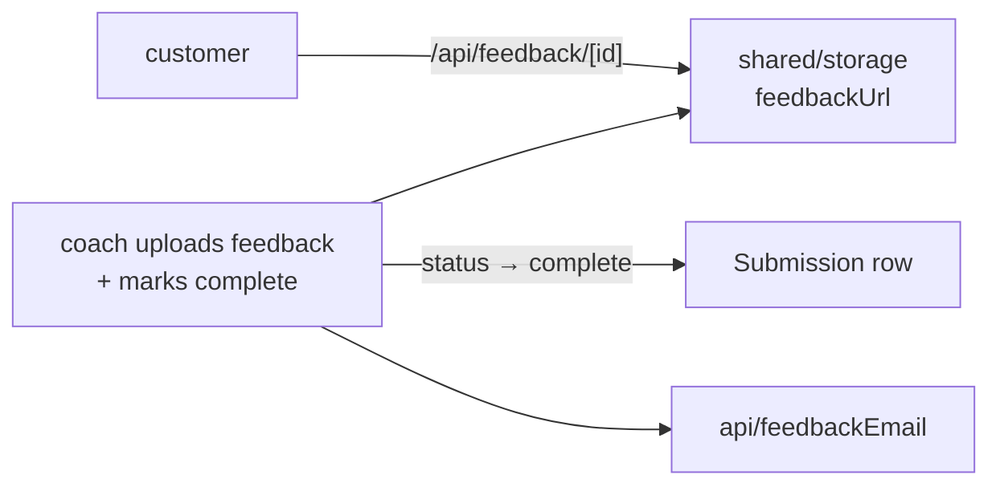

# feedback — `src/domains/feedback/`

The **feedback domain slice** — the coach's response coming back. The thinnest slice in the
codebase, and honestly so: in v1 the actual coaching happens entirely off-platform.

---

## 1 · The northstar

A coach watches the customer's video and records a walkthrough. From the **coach portal**
they upload that file and mark the submission `complete`; we store the file and email the
customer their download link. By then they've been gone for days, so email is the only way
to reach them.

### The invariants

- **The feedback download is public but complete-only.** `/api/feedback/[id]` serves the
  file only once `status = complete`. The customer isn't logged in and reaches it from their
  status lookup; the id is an unguessable uuid — the same URL-as-capability trade-off the
  status page already makes.
- **The email is best-effort** ([ADR 004](../../../docs/decisions/004-best-effort-email.md)) —
  a send failure never blocks marking a submission complete.
- **`feedbackEmailedAt` guards a double-send** — checked before, stamped after (wired with
  the coach portal's complete action).

### The pieces

- `api/feedbackEmail.ts` — the payoff message ("your feedback is ready").
- No model, no UI **yet** — the coach-facing upload + mark-complete lands in the coach
  portal (in progress); this slice owns the email and will own the completion logic.

---

> **Updated 2026-07-30.** Two things changed under this slice without changing its code much:
>
> - **Completing now starts a clock.** `storeFeedbackAndComplete` stamps `completedAt` as
>   well as the status, because the retention sweep counts from it. It briefly didn't, and
>   completed submissions were never swept — the status said finished while the clock never
>   started. If another action ever takes over "complete", it must stamp it too.
> - **The customer's uploads are deleted `retainResolvedHours` after that stamp; the coach's
>   feedback file never is.** The customer's only route to what they bought is the link in
>   their email, so sweeping `feedbackUrl` would delete the deliverable
>   ([ADR 012](../../../docs/decisions/012-retention-and-operator-settings.md)).
>
> - **Yuta's approval gate landed.** A coach's upload now moves the submission to
>   `awaiting_approval` rather than completing it; `approveAndComplete` is what sets
>   `complete`, stamps `completedAt`, and emails the customer. The coach no longer reaches the
>   customer directly. Still missing: anything that *tells* Yuta a response is waiting — see
>   [`shared/email/_EmailDocumentation.md`](../../shared/email/_EmailDocumentation.md).
>
> **Updated 2026-08-01 · feedback is multi-file now.** A coach can attach **several** files
> and hand the set to Yuta. Each file is a row in `submission_files` with `kind = "feedback"`
> (the old single `feedbackUrl` column is unused), uploaded through the customer's own
> transport with operator-gated endpoints — direct-to-Blob in prod (`/api/feedback/blob` +
> `/api/feedback/complete`), proxied to disk in dev (`/api/feedback/upload`). Attaching a file
> no longer advances the submission; a separate `sendFeedbackForApproval` (guarded to require
> ≥1 file) parks it at `awaiting_approval`, and `approveAndComplete` (guarded the same way)
> finishes it. `/api/feedback/[id]` now serves a feedback file **by the file's own id**, and
> the customer's status page + the admin review both list every file. The feedback-ready email
> points at `/status` rather than one deep link, since a review can be several files.

## 2 · Where we are now — 2026-07-29

- ✅ **The feedback-ready email template** (`sendFeedbackReady`), ready to fire from the coach
  portal's mark-complete action.
- ✅ **The customer download** — `/api/feedback/[id]`, complete-only (404 before completion).
- 🔶 **The coach's upload + mark-complete action isn't wired yet** — it lands with the coach
  portal. Until then nothing sets `feedbackUrl` or `status = complete` outside the seed.
- 🔶 **No `/feedback/[id]` viewer page** — the customer downloads the file rather than
  watching it in-app. Fine for a downloadable coaching file; revisit if we want an embedded
  player.
- 🔶 **The feedback link is unguessable but unauthenticated** — anyone with the URL can
  download. Accepted for now; worth revisiting before volume grows.

---

## 3 · Where we came from

**2026-07-29 · Storage/Postgres cutover.** The Airtable automation, `/api/webhooks/airtable`,
and `feedbackWebhook.ts` are gone. "Feedback ready" is becoming a coach-portal action that
stores the file (`shared/storage`) and sends the email directly — no external automation.
Everything below is the Airtable era, kept as the trail.

**Before 2026-07-28**, the feedback email lived in `lib/email.ts` alongside the other two,
and there was no feedback domain at all — the concept existed only as a column in Airtable
and a branch in a webhook handler. Step 2 gave it a home, which is what made the gaps above
visible as gaps rather than absences nobody had named.

Decisions taken, with their reasoning:

- **The feedback-ready email is sent by our app, not Make.com** (2026-07-28, superseding
  CLAUDE.md §7). The spec had Make.com watching Airtable and sending it. Building it as an
  Airtable automation calling our own endpoint put the template beside the other two and
  removed the one scenario that justified a Make.com subscription — which is why dropping
  Make.com entirely is now recommended in OPERATIONS.md.
- **`Feedback Emailed` checkbox → `Feedback Emailed At` timestamp** (Step 1). Same
  truthiness, but it tells Yuta *when* — useful when a customer says they never got it.
- **The notify flow moved out of the route (Step 2b).** The constant-time secret check lives
  beside what it guards rather than in a general-purpose helper — this is the one webhook
  without an SDK signature to verify, so that comparison *is* the endpoint's defence, and it
  shouldn't be somewhere it could drift out of use. The route now maps a `NotifyResult` to a
  status code and nothing else.
- **The slice was created even though it holds one file.** The alternative was leaving the
  email in a shared bucket, which would have left "what happens when feedback is ready" with
  no home to document. Naming the domain is what surfaced the missing viewer page.
