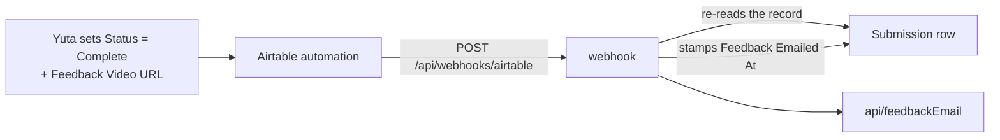

# feedback — `src/domains/feedback/`

The **feedback domain slice** — the coach's response coming back. The thinnest slice in the
codebase, and honestly so: in v1 the actual coaching happens entirely off-platform.

---

## 1 · The northstar

A coach watches the video and records a walkthrough. Yuta pastes the link into Airtable and
sets `Status = Complete`. **Our only job is telling the customer it's ready** — by then
they've been gone for days, so email is the only way to reach them.

### The invariants

- **The webhook re-reads the record; it never trusts the payload.** The automation sends
  only a record id, and everything the email needs is fetched fresh.
- **Idempotent two ways:** `Feedback Emailed At` is checked before sending and stamped
  after, and the Airtable trigger fires once per record. Either alone would mostly work;
  both means a manually re-fired automation still can't double-send.
- **A stamp failure is logged, never fatal.** Returning 500 would make Airtable retry — and
  re-send the email it just sent. The failure mode of the guard must not be worse than
  having no guard.
- **`Complete` without a `Feedback Video URL` sends nothing**, and returns 200 so the
  automation doesn't retry. An email with no link is worse than no email.
- **The endpoint authenticates with a constant-time comparison** of a shared secret. It's
  the one webhook without SDK signature verification, so the comparison being timing-safe is
  the whole of its defence.

### The pieces

- `api/feedbackEmail.ts` — the payoff message.
- `api/feedbackWebhook.ts` — the shared-secret check and the notify flow.
- No model, no UI, **and that's the honest shape** — see below.

---

## 2 · Where we are now — 2026-07-28

- ✅ **The feedback-ready email**, fired by the Airtable automation, idempotent.
- 🔶 **No `/feedback/[id]` viewer.** CLAUDE.md Sprint 5 specifies a page showing the coach's
  video, notes, and any PDF. Today the email links straight out to Loom and `/status`
  offers the same link. **This is the main gap in the slice** — and the one that would make
  it a real domain rather than an email sender.
- 🔶 **No coach notes or PDF surface.** The schema has no column for either; the coach's
  entire output is one URL.
- 🔶 **The feedback link is unguessable but unauthenticated** — anyone with the URL can
  watch. Accepted for v1 (CLAUDE.md Sprint 5 documents the tradeoff), but it is a real
  exposure worth revisiting before volume grows.

**Being a nearly-empty slice is the correct current state, not neglect.** Coaching is
delivered by humans over email, per CLAUDE.md §2's anti-scope. This slice grows when the
viewer page is built — not before.

---

## 3 · Where we came from

**Before 2026-07-28**, the feedback email lived in `lib/email.ts` alongside the other two,
and there was no feedback domain at all — the concept existed only as a column in Airtable
and a branch in a webhook handler. Step 2 gave it a home, which is what made the gaps above
visible as gaps rather than absences nobody had named.

Decisions taken, with their reasoning:

- **The feedback-ready email is sent by our app, not Make.com** (2026-07-28, superseding
  CLAUDE.md §7). The spec had Make.com watching Airtable and sending it. Building it as an
  Airtable automation calling our own endpoint put the template beside the other two and
  removed the one scenario that justified a Make.com subscription — which is why dropping
  Make.com entirely is now recommended in OPERATIONS.md.
- **`Feedback Emailed` checkbox → `Feedback Emailed At` timestamp** (Step 1). Same
  truthiness, but it tells Yuta *when* — useful when a customer says they never got it.
- **The notify flow moved out of the route (Step 2b).** The constant-time secret check lives
  beside what it guards rather than in a general-purpose helper — this is the one webhook
  without an SDK signature to verify, so that comparison *is* the endpoint's defence, and it
  shouldn't be somewhere it could drift out of use. The route now maps a `NotifyResult` to a
  status code and nothing else.
- **The slice was created even though it holds one file.** The alternative was leaving the
  email in a shared bucket, which would have left "what happens when feedback is ready" with
  no home to document. Naming the domain is what surfaced the missing viewer page.
