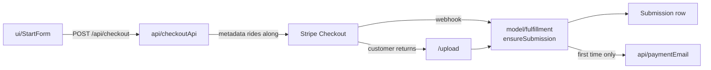

# payment — `src/domains/payment/`

The **payment domain slice** — paying for a review. Almost entirely **verb**: there is no
Payment record of our own. Stripe holds the money and the truth about it; what we persist is
a submission carrying the payment's id.

---

## 1 · The northstar

Money clearing is what brings a submission into existence. This slice owns that moment and
nothing after it.

### The invariants

- **`ensureSubmission()` is idempotent on the Stripe payment id, and has two callers** — the
  webhook and the upload endpoint. Whichever arrives first creates the row; the other finds
  it. This is what makes the race between "customer redirected back" and "webhook delivered"
  a non-event rather than a bug. *(See [ADR 003](../../../docs/decisions/003-shared-idempotent-fulfillment.md).)*
- **Any future path that creates a submission must go through it.** A second creation site
  reintroduces the race and the double-email.
- **The confirmation email is gated on `created === true`**, so Stripe retrying a webhook
  can't send a second one.
- **Payment is verified against Stripe, never against our own row.** The row could be stale,
  and the session id arrives from the browser.
- **Stripe's email beats the form's.** A customer can change their address inside Stripe's
  flow, so `customer_details.email` is more current than what they typed.
- **Metadata keys are domain property names**, so fulfillment reads them straight across
  with no translation layer. Stripe caps each value at 500 characters — notes are the only
  field that could approach it, and they're truncated at validation.

### The pieces

- **the VERB** — `api/checkoutApi.ts` (create the session, verify a paid one) ·
  `api/paymentWebhook.ts` (verify Stripe's events, act on them) ·
  `model/fulfillment.ts` (session → submission, idempotently) · `ui/StartForm.tsx` (the
  player-info form) · `api/paymentEmail.ts` ("we took your money, here's what's next").
- No `model/` type: **the noun lives in Stripe.** A slice that's all verb is legitimate
  (PRINCIPLES #4).

---

## 2 · Where we are now — 2026-07-28

- ✅ **Hosted Stripe Checkout** — form → session → redirect → return to `/upload`.
- ✅ **Idempotent fulfillment**, shared by both entry paths.
- ✅ **Payment confirmation email.**
- ✅ **Inline pricing from `shared/config/site.ts`** when `STRIPE_PRICE_ID` is unset, so the
  client needn't create a Stripe Product to launch.
- 🔶 **Still hosted Checkout, not Elements.** Approved for rebuild and **not yet started** —
  the whole point is keeping payment on our own domain inside our own layout. This is the
  largest outstanding gap in the slice. *(See [ADR 005](../../../docs/decisions/005-stripe-elements-over-checkout.md).)*
- ✅ **`StartForm` on React Hook Form + the shared Zod schema**, with per-field errors on
  blur and a redirect guard so the button can't be double-pressed during handoff to Stripe.

---

## 3 · Where we came from

**Before 2026-07-28**, this slice was four files in four folders: `lib/stripe.ts`,
`lib/fulfillment.ts`, `app/api/checkout/route.ts` (which held the session-building logic
inline), and `app/start/start-form.tsx`. To see "everything about payment" you opened all
four, related only by the reader's memory. Step 2 collected them.

Decisions taken, with their reasoning:

- **`ensureSubmission` extracted and given two callers** — from the original build. The
  alternative was blocking the customer behind a poll-and-wait spinner until the webhook
  landed. Making the operation idempotent removed the ordering requirement entirely instead
  of handling it.
- **Verify against Stripe, not Airtable** — from the original build. CLAUDE.md §7 had
  specified checking our own row; verifying upstream is strictly stronger and costs one API
  call. The spec was amended.
- **Elements over hosted Checkout (2026-07-28, Ben).** Hosted Checkout is *not* unbranded —
  Stripe's dashboard carries a logo, colours, and fonts. The argument that decided it was
  that hosted Checkout is a full-page handoff to another domain: we control neither the
  layout, the surrounding copy, nor the URL bar. For a service asking a parent to pay $149
  up front to strangers overseas, the moment of payment is where trust is won or lost.
  Rebuild pending. *(Full reasoning: [ADR 005](../../../docs/decisions/005-stripe-elements-over-checkout.md).)*
- **Webhook verification and handling moved out of the route (Step 2b).** The route had been
  holding signature verification and `handleCheckoutCompleted` — what a completed checkout
  *means*, sitting in the app layer. `app/api/` can't move (Next.js makes the path the URL),
  but its contents can: it's the composition root now, and the route is 30 lines.
- **Checkout logic lifted out of the route handler (Step 2).** The route now owns HTTP —
  parsing, status codes — and the domain owns what it means to charge for a review. Routes
  are compositions, not homes.
