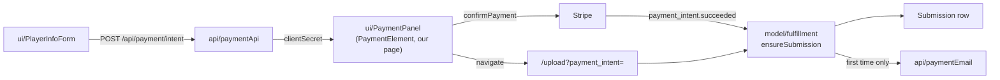

# payment — `src/domains/payment/`

The **payment domain slice** — paying for a review. Almost entirely **verb**: there is no
Payment record of our own. Stripe holds the money and the truth about it; what we persist is
a submission carrying the payment's id.

---

## 1 · The northstar

Money clearing is what brings a submission into existence. This slice owns that moment and
nothing after it.

### The invariants

- **Both steps live on ONE route.** A deliberate departure from CLAUDE.md §5's separate
  `/submit` and `/submit/payment` pages: it keeps the client secret in memory instead of a
  URL, and a full page navigation between "your details" and "pay" would reintroduce exactly
  the seam ADR 005 paid to remove.
- **`ensureSubmission()` is idempotent on the Stripe payment id, and has two callers** — the
  webhook and the upload endpoint. Whichever arrives first creates the row; the other finds
  it. This is what makes the race between "customer redirected back" and "webhook delivered"
  a non-event rather than a bug. *(See [ADR 003](../../../docs/decisions/003-shared-idempotent-fulfillment.md).)*
- **Any future path that creates a submission must go through it.** A second creation site
  reintroduces the race and the double-email.
- **The confirmation email is gated on `created === true`**, so Stripe retrying a webhook
  can't send a second one.
- **Payment is verified against Stripe, never against our own row.** The row could be stale,
  and the session id arrives from the browser.
- **`receipt_email` is the authoritative address.** We set it when creating the intent, and
  it's what Stripe mails its own receipt to, so fulfillment prefers it over metadata.
- **`redirect: "if_required"`.** Plain cards confirm without leaving the page; only methods
  that demand a redirect (3-D Secure, wallets) take the return trip. Without this every
  payment would bounce out and back.
- **A `processing` intent is neither claimed as success nor as failure.** The customer is
  told it's still clearing and that we'll email — because that's what's true.
- **Metadata keys are domain property names**, so fulfillment reads them straight across
  with no translation layer. Stripe caps each value at 500 characters — notes are the only
  field that could approach it, and they're truncated at validation.

### The pieces

- **the VERB** — `api/paymentApi.ts` (create a PaymentIntent, verify a succeeded one) ·
  `api/paymentWebhook.ts` (verify Stripe's events, act on them) ·
  `model/fulfillment.ts` (intent → submission, idempotently) ·
  `ui/SubmitFlow.tsx` (the two-step orchestrator) · `ui/PlayerInfoForm.tsx` (step one) ·
  `ui/PaymentPanel.tsx` (step two — Elements on our own page) ·
  `api/paymentEmail.ts` ("we took your money, here's what's next").
- No `model/` type: **the noun lives in Stripe.** A slice that's all verb is legitimate
  (PRINCIPLES #4).

---

## 2 · Where we are now — 2026-07-28

- ✅ **Stripe Elements on our own page** (Step 5, 2026-07-29) — player details, then payment
  in place, then `/upload`. Our layout, our order summary, our domain.
- ✅ **Verified against real Stripe 2026-07-29** (test mode, via `npm run payment`):
  `createPaymentIntent` → confirmed with `pm_card_visa` → `succeeded` →
  `getSucceededPaymentIntent` ✓ (and `null` for a bogus id) → signed webhook 200 → the
  submission row correct in every field → **re-delivery produced no duplicate**. (The webhook
  now writes that row to **Postgres**; the fulfillment logic verified here is unchanged.)
  A declined card (`pm_card_chargeDeclined`) created **no row**, which is the important
  negative: a failed payment must never look like a submission. A 3-D Secure card returned
  `requires_action`, correctly.
- 🔶 **The `<PaymentElement>` UI is still unverified.** Everything server-side is proven, but
  that the card field renders, that the appearance variables took, and that the 3-D Secure
  modal behaves all need a human in a browser. **That's the remaining gap in this slice.**
- 🔴 **`NEXT_PUBLIC_STRIPE_PUBLISHABLE_KEY` must be set in Vercel** or the deployed payment
  step renders a "payments aren't configured" notice instead of a card field.
- 🔴 **The live-mode webhook endpoint doesn't exist yet.** A test endpoint was created
  (`we_1TyhuB…`, correct events); live mode is a separate object with a different secret and
  needs the live key.
- ✅ **Idempotent fulfillment**, shared by both entry paths.
- ✅ **Payment confirmation email.**
- ✅ **Inline pricing from `shared/config/site.ts`** when `STRIPE_PRICE_ID` is unset, so the
  client needn't create a Stripe Product to launch.

- ✅ **`StartForm` on React Hook Form + the shared Zod schema**, with per-field errors on
  blur and a redirect guard so the button can't be double-pressed during handoff to Stripe.

---

## 3 · Where we came from

**2026-07-29 · Postgres cutover.** Unchanged in shape: `ensureSubmission` and the webhook
kept their signatures, so this slice barely moved. What changed underneath is that
`createSubmission`/`findByStripePaymentId` now hit Postgres instead of Airtable, and
`fulfillment` writes status `awaiting_upload` (lowercase enum) with the amount in cents. The
idempotency and verify-against-Stripe invariants are exactly as before.

**Before 2026-07-28**, this slice was four files in four folders: `lib/stripe.ts`,
`lib/fulfillment.ts`, `app/api/checkout/route.ts` (which held the session-building logic
inline), and `app/start/start-form.tsx`. To see "everything about payment" you opened all
four, related only by the reader's memory. Step 2 collected them.

Decisions taken, with their reasoning:

- **`ensureSubmission` extracted and given two callers** — from the original build. The
  alternative was blocking the customer behind a poll-and-wait spinner until the webhook
  landed. Making the operation idempotent removed the ordering requirement entirely instead
  of handling it.
- **Verify against Stripe, not Airtable** — from the original build. CLAUDE.md §7 had
  specified checking our own row; verifying upstream is strictly stronger and costs one API
  call. The spec was amended.
- **Elements shipped (Step 5, 2026-07-29).** `Stripe Payment ID` needed no migration, exactly
  as ADR 005 predicted — the column was named for the role rather than the Stripe object, so
  it simply started holding a PaymentIntent id. `checkoutApi.ts` became `paymentApi.ts` and
  `/api/checkout` became `/api/payment/intent`, since "checkout" now names a Stripe product
  we no longer use.
- **`NEXT_PUBLIC_STRIPE_PUBLISHABLE_KEY` went to a new `shared/config/publicEnv.ts`**, not
  `env.ts`. A client component importing `env.ts` would pull a module of secret getters into
  the browser bundle — harmless today, and exactly the thing that stops being harmless after
  one more getter is added. The invariant is now "`process.env` is read only in
  `shared/config/`", split by audience.
- **Elements over hosted Checkout (2026-07-28, Ben).** Hosted Checkout is *not* unbranded —
  Stripe's dashboard carries a logo, colours, and fonts. The argument that decided it was
  that hosted Checkout is a full-page handoff to another domain: we control neither the
  layout, the surrounding copy, nor the URL bar. For a service asking a parent to pay $149
  up front to strangers overseas, the moment of payment is where trust is won or lost.
  Rebuild pending. *(Full reasoning: [ADR 005](../../../docs/decisions/005-stripe-elements-over-checkout.md).)*
- **Webhook verification and handling moved out of the route (Step 2b).** The route had been
  holding signature verification and `handleCheckoutCompleted` — what a completed checkout
  *means*, sitting in the app layer. `app/api/` can't move (Next.js makes the path the URL),
  but its contents can: it's the composition root now, and the route is 30 lines.
- **Checkout logic lifted out of the route handler (Step 2).** The route now owns HTTP —
  parsing, status codes — and the domain owns what it means to charge for a review. Routes
  are compositions, not homes.
