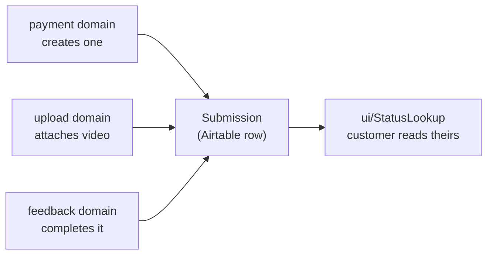

# submission — `src/domains/submission/`

The **submission domain slice** — one folder holding both what a Submission **is** (the noun)
and what a customer **does** with it (looks theirs up). The paid request for video feedback:
the record every other domain orbits.

---

## 1 · The northstar

A submission is **one paid request for one video review**. It is created the moment money
clears, and it accumulates: first the payment, then the video, then the coach's response.
Its `Status` is the whole workflow in one field.

**This slice imports no other domain.** Payment, upload, and feedback all import *it*. That
asymmetry is the architecture: arrows point at the record, and the graph can't cycle.

### The invariants

- **Every Airtable column name in this codebase lives in `api/submissionSchema.ts`.** No
  other file may contain one. A rename is one line here plus a migration on the client's
  base. *(PRINCIPLES #2.)*
- **Three columns are read-only to the app** and the codec refuses to write them even if a
  caller asks: `Submission ID` and `Submitted At` are Airtable-computed; `Assigned Coach` is
  Yuta's. Enforced at runtime, not just in types — a cast can slip past the compiler.
- **Email is normalized to lowercase on write and on read.** Airtable's formula comparison
  is case-sensitive and customers don't type their address the same way twice.
- **`PublicSubmission` is the only shape that leaves the building.** The lookup identifies
  customers by an *unverified* email, so anything on that type is visible to anyone who
  guesses an address. Adding a field to it is a security decision, which is why it lives
  here rather than in the route that serializes it.
- **Malformed stored data degrades, never crashes.** An unrecognized `Status` or `Focus` —
  a typo'd select option in the base — is dropped rather than trusted into a bad type.
- **The app writes only `Awaiting Upload` and `New`.** The other three statuses are Yuta's,
  expressed in the type system as `AppWrittenStatus`.

### The pieces

- **the NOUN** — `model/submission.ts` (the type family, `SUBMISSION_STATUSES`,
  `FOCUS_OPTIONS`) · `api/submissionSchema.ts` (the codec — the storage seam) ·
  `api/submissionApi.ts` (the queries).
- **the VERB** — `ui/StatusLookup.tsx` (email in, your submissions out) ·
  `model/submissionInput.ts` (validating what a customer types before they pay) ·
  `model/publicSubmission.ts` (the trim-to-safe projection).
- `index.ts` — the barrel. Consumers import `@/domains/submission`.

The status lookup lives here rather than in its own domain because *checking your
submissions* is a verb over this noun, not a separate concept. That's PRINCIPLES #4 doing
its job.

---

## 2 · Where we are now — 2026-07-28

- ✅ **The type family** — `Submission`, `SubmissionPatch`, `SubmissionStatus`, `Focus`.
- ✅ **The codec** — bidirectional, with a runtime read-only guard and defensive reads.
  Covered by a 22-assertion round-trip check (run ad hoc; no test framework in the repo yet).
- ✅ **The queries** — create, update, get, and four finders.
- ✅ **The status lookup** — `/status` → `POST /api/status` → sanitized list.
- 🔶 **No rate limit on the lookup.** `/api/status` enumerates customers by email at
  unlimited rate. CLAUDE.md Sprint 5 calls for 5/IP/min. **This is the outstanding security
  gap in this slice** — Step 3.
- 🔶 **No Zod.** `model/submissionInput.ts` hand-rolls validation and the client form
  validates with nothing but HTML `required`, so the two can drift. Step 3.
- 🔶 **`Assigned Coach` is plain text.** Becomes a linked record if a Coaches table ever
  earns its place (CLAUDE.md §8).

---

## 3 · Where we came from

**2026-07-28 · Step 1 — the naming sweep.** Column names used to be bare string literals in
six files, and one concept carried three names: the coaching focus was `focus` in code,
`Sport` in Airtable (holding `"Hitting"`), and `Skill Focus` in the spec. A rename in the
base broke the app silently, in six places. The codec was built to make that impossible.

Decisions taken, with their reasoning:

- **`Sport` → `Focus`.** The column never held a sport. Nobody reading Yuta's base could
  tell what it meant.
- **Kept five focus values, standardized on `Hitting`** over CLAUDE.md's `Batting`. The
  existing data, the coach bios, and the FAQ copy all said Hitting; changing the word would
  have meant migrating rows *and* editing marketing copy to satisfy a spec written before
  either existed. The spec was amended instead.
- **`Notes` split into `Customer Notes` + `Internal Notes`.** One column had been holding
  both what the parent wrote and `[system]` error messages appended by the Mux handler, so
  nothing could be forwarded to a coach without hand-cleaning first. *(PRINCIPLES #2 — one
  home per fact; two facts had been sharing one.)*
- **`Created At` → `Submitted At`, as an Airtable created-time field.** It had been an
  app-written string sitting in an editable cell, and the status lookup sorts on it — one
  stray edit from broken ordering. Now it can't be edited at all.
- **Status 3 → 5.** Without `New` and `Assigned`, Yuta couldn't distinguish "needs a coach"
  from "a coach has it" — which is the queue he actually works from.
- **Column names, not Airtable field IDs.** Field IDs would survive a rename in the UI, but
  `fld7Kd2mQ` is unreadable and IDs differ between the dev and production bases. Chose
  readability plus a single declaration site; the tradeoff is that a rename in Airtable needs
  a matching one-line code change, which OPERATIONS.md warns the client about.
- **`Stripe Session ID` → `Stripe Payment ID`** — named for the *role*, not the Stripe
  object, so the pending Elements rebuild changes what it holds without another migration of
  the client's live base. *(See [ADR 005](../../../docs/decisions/005-stripe-elements-over-checkout.md).)*

**2026-07-28 · Step 2b — the routes got thin.** The status route had been holding the
`PublicSubmission` type and its projection inline. That put "what is safe to show a stranger"
in the app layer, where it read as serialization rather than as the security decision it is.
Moved to `model/publicSubmission.ts`, and the route now calls `lookupPublicSubmissions()`.
The email-validation regex was also duplicated between the route and `submissionInput.ts` —
two copies of one question, free to drift into accepting different things. Now one
`isValidEmail`.

**2026-07-28 · Step 2 — domain-first.** The slice moved here from three separate homes:
`src/types/submission.ts` (the type), `src/integrations/airtable/` (schema + queries), and
`src/lib/submission-input.ts` (validation), with `StatusLookup` lifted out of
`src/app/status/status-form.tsx`. Four folders became one. `AirtableRecord` went the other
way — down to `shared/airtable/`, because the raw record shape is true of any table
(PRINCIPLES #5), and `shared/` importing a domain would have inverted the dependency.
