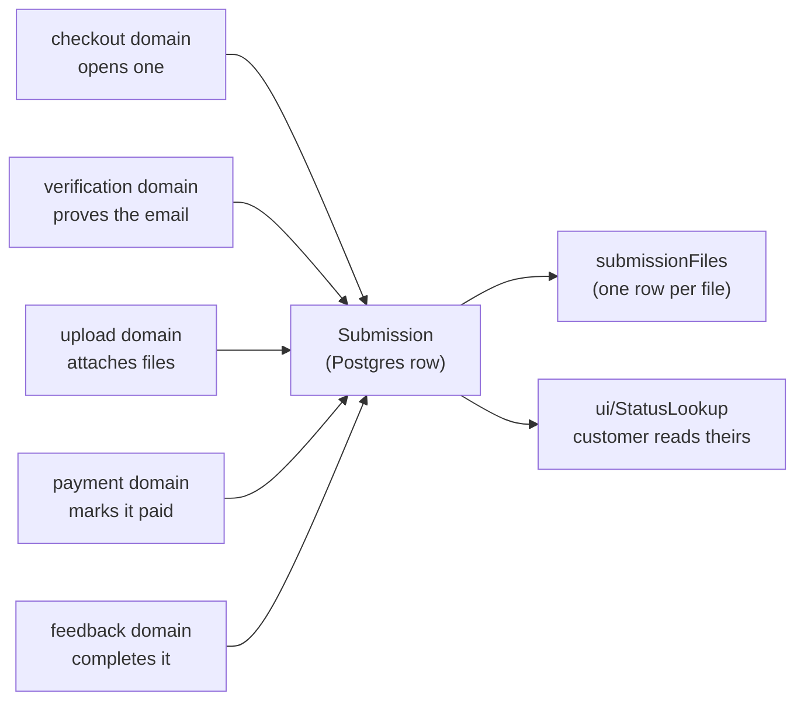

# submission — `src/domains/submission/`

The **submission domain slice** — one folder holding both what a Submission **is** (the noun)
and what a customer **does** with it (looks theirs up). One request for coaching feedback:
the record every other domain orbits.

---

## 1 · The northstar

A submission is **one request for coaching feedback, carrying a pack of files** — not one
video. A customer attaches whatever shows the problem: a clip or two, a still of their grip,
a PDF from a previous coach. Up to `maxFilesPerSubmission`, each up to `maxFileSizeMb`, both
set by the operator. One payment buys one *review of the pack*, and the coach answers it with
a single response.

That plural is the shape of the data, not a detail: it's why `submissionFiles` is a table and
not a column, and why anything phrased as "the video" is a bug in the making. The single
`videoUrl` field this replaced could only ever hold one locator.

It is created at the *first* step of the flow — before verification, before files, before
money — and it accumulates: the proof of email, then the files, then the payment, then the
coach's response. Its `status` is the whole workflow in one field, and **[§2 · The northstar
path](#2--the-northstar-path--inception-to-completion) is the canonical account of that
journey** — read it before changing any stage.

**Nothing is retained until the payment clears.** Before that a submission is a scratch pad:
a refresh, a ten-minute idle timeout, or "Start over" discards it — files and record together
(`discardUnpaidSubmission`). Only a paid submission earns a place in the queue, and only a
paid one is safe from being scrubbed.



**This slice imports no other domain.** Verification, upload, payment, feedback and checkout
all import *it*. That asymmetry is the architecture: arrows point at the record, and the
graph can't cycle.

### The invariants

- **The storage column names live in the Drizzle schema (`shared/db`), and the row↔domain
  mapping lives in `api/submissionRow.ts`.** No other file turns a DB row into a Submission.
  A schema change is a Drizzle migration. *(PRINCIPLES #2.)*
- **Email is normalized to lowercase on write and on lookup**, so a customer who checks out
  as `Alex@x.com` and later looks up `alex@x.com` finds their own submission.
- **One schema validates on both sides.** `model/submissionInput.ts` holds the Zod schemas;
  the client form and the API route use the same objects, so they cannot drift into
  disagreeing about what's acceptable. **The server always re-validates** — client validation
  is a courtesy to honest users, not a boundary.
- **Email is normalized *before* it's validated**, not after. A trailing space from a mobile
  keyboard's autocomplete would otherwise be rejected as an invalid address.
- **`PublicSubmission` is the only shape that leaves the building.** The lookup identifies
  customers by an *unverified* email, so anything on that type is visible to anyone who
  guesses an address. Adding a field to it is a security decision, which is why it lives
  here rather than in the route that serializes it.
- **`status` and `focus` are Postgres enums**, so the DB itself rejects a bad value — no
  runtime guard needed the way the Airtable single-selects required one.
- **The customer-facing flow writes only `draft`, `awaiting_payment` and `new`.** The other
  three are driven from the operator portal, expressed as `AppWrittenStatus`.
- **The flow cookie carries a submission id and nothing else.** Whether the email is verified
  lives on the row, so a stale cookie can't claim a verification that never happened
  ([ADR 010](../../../docs/decisions/010-verification-gates-upload.md)).
- **A file record outlives its bytes.** The retention sweep clears `fileUrl` and leaves the
  row, so the portal and the receipt can still say what was sent. `isAvailable()` is the
  honest way to ask.

### The pieces

- **the NOUN** — `model/submission.ts` (the type family, `SUBMISSION_STATUSES`,
  `FOCUS_OPTIONS`) · `model/submissionFile.ts` (one uploaded file) ·
  `api/submissionRow.ts` (the row↔domain mapper — the storage seam) ·
  `api/submissionApi.ts` and `api/submissionFileApi.ts` (the Drizzle queries).
- **the VERB** — `ui/PlayerInfoForm.tsx` (step 1 of the flow) · `ui/StatusLookup.tsx` (email
  in, your submissions out) · `ui/SubmissionFileList.tsx` (the operator's view of what
  arrived) · `api/flowSession.ts` (which submission this browser owns) ·
  `model/submissionInput.ts` (validating what a customer types) ·
  `model/publicSubmission.ts` (the trim-to-safe projection).
- `index.ts` — the barrel. Consumers import `@/domains/submission`.

The status lookup lives here rather than in its own domain because *checking your
submissions* is a verb over this noun, not a separate concept. That's PRINCIPLES #4 doing
its job.

---

## 2 · The northstar path — inception to completion

**This is the canonical journey, and the single reference for it.** Every other
doc describes a slice; this is the whole arc, so a proposed change to any stage
can be checked against what comes before and after. Refine it here first.

**It describes the northstar, not the build.** Each cell states where the step is
going, in present tense; where today's code differs, a *(today: …)* or
*(not built)* note says so without weakening the statement. Read the table for
the destination, read the notes for the distance still to travel.

### How to fill a row

Six rules. They exist because each was got wrong at least once while the table
was being written, and each mistake was invisible until it was named.

1. **A row is a move, not a state.** If you can't name a trigger, it isn't a row —
   it's a condition, and it belongs in someone else's *Before* or *After*.
2. **Trigger is the pivot.** Everything left of it is already true when the stage
   begins; everything right of it is caused by it. **A fact on the wrong side of
   that column means the row is wrong** — which is a thing you can check by
   reading, not by knowing the code.
3. **State what is, not what isn't.** "Nothing exists yet", "not yet notified",
   "no session needed" describe absence. Say what *is* true instead. Absences are
   real and worth recording — they go in an audit's gaps layer, not in the path.
4. **Cells hold content, not navigation.** No "see below", no cross-references.
   If a cell can't hold the detail, the detail belongs in a section of its own and
   the reader will find it.
5. **Write the real names, never a paraphrase.** `startSubmissionAction`, not
   "the submit handler". `emailVerifiedAt`, not "the verified flag". These are
   the shared vocabulary between this table, the admin screen and the source, so
   a mismatch between the three is *discoverable by reading* — and the table
   earns its keep as a nomenclature check, not just a description.

   It cuts the other way too: **if a name needs explaining every time it appears
   here, the name is wrong in the code.** Nomenclature should carry meaning, not
   require it. (PRINCIPLES §11.)
6. **One scope per column.** Don't let a cell answer a neighbouring column's
   question; the overlap is where drift starts.
7. **Resolve the chain across the row — don't defer it to prose.** A trigger
   rarely does one thing. **① ② ③ …** are its operations *in execution order*,
   one per column, so a row read left to right is a complete cause-and-effect
   chain: who, in what state, under what conditions, does what — which causes
   this, then this, then this — ending in an outcome, a message, a retention
   answer and a status move.

   Say which operations can abort the stage and which fail silently; that
   difference is usually the interesting part. Stages have different lengths, so
   the later columns are often blank — see rule 8. **Width is not a constraint;
   an unresolved row is.**
8. **A blank cell is an answer, and it has to be a true one.** Blank means
   *nothing happens in this dimension at this point* — no email fires, no status
   moves, nothing is retained. Don't pad it with "—" or "n/a"; the emptiness is
   the information, and a column of blanks broken by one entry is exactly how you
   see where something actually happens.

   Blank is **not** the same as missing. Where something *ought* to happen and
   doesn't, mark it **⚠️** and say so. That single distinction is what keeps the
   table honest as it gets sparser: silence means "correctly nothing", ⚠️ means
   "a gap we know about". If you can't tell which a cell is, the cell is wrong.

   **The whole grid is the story — blanks included.** A row's meaning comes as
   much from the columns it leaves empty as the ones it fills.

   Keep the cell itself empty — the sparseness is what makes the pattern
   readable — and give the reason in one line beneath the table. Some blanks are
   incidental; others are a decision, and those are worth saying out loud.
9. **Write the northstar, not the current state.** Every cell describes the
   destination, in present tense — the version of this step we're building toward,
   whether or not it exists. That's PRINCIPLES §12: present tense is the
   northstar, and it's never about legacy.

   Reality is recorded as an **appended note**, never by softening the statement:

   | Marker | Means |
   | --- | --- |
   | *(today: …)* | the step exists but the code differs from the northstar |
   | *(not built)* | the step is agreed and nothing implements it yet |
   | ⚠️ | a gap in the northstar itself — something that *should* be decided or built and isn't |

   The reason for the separation: a doc that describes what the code happens to
   do can only ever justify the code. Stating the destination first means the
   difference between the two is visible in every row, and a divergence becomes
   a to-do rather than a description.

   Keep the cell itself empty — the sparseness is what makes the pattern
   readable — and give the reason in one line beneath the table. Some blanks are
   incidental; others are a decision, and those are worth saying out loud.

What each column holds:

| Column | Holds | Not |
| --- | --- | --- |
| **① ② ③ …** | one operation of the trigger, in execution order, marked if it can abort or fails silently | a summary — that's *Outcome* |
| **Outcome** | where the actor is left, and what is now possible | the mechanics — those are the numbered columns |
| **Stage** | a short phrase naming the move | a status value — that's the last column |
| **Who** | the actor whose action causes it | the system, unless genuinely nobody triggers it |
| **Before** | what is already true as the stage begins | anything the trigger causes; anything absent |
| **Viable when** | every condition that must hold at the instant of the trigger | why the condition exists — that's prose, not a cell |
| **Trigger** | the literal control pressed, or the event that arrives | what it causes |
| **Email** | which numbered message fires, or ⚠️ if none does | messages that *should* exist — mark those, don't imply them |
| **Retention** | whether the submission survives being abandoned at this point | |
| **`status`** | `from → to`, or *(unchanged)* | the destination on its own — the move is the information |

| # | Stage | Who | Before | Viable when | Trigger | ① | ② | ③ | ④ | ⑤ | ⑥ | Outcome | Email | Retention | `status` |
|---|---|---|---|---|---|---|---|---|---|---|---|---|---|---|---|
| 1 | Details submitted | customer | • Step 1 of 4 — the customer is filling in the form<br>• Their previous unfinished attempt, if any, is still on record | the form is valid · they're under the abuse limit<br>No account or session — this is the front door | **“Continue to email verification”** → `startSubmissionAction` | any earlier unpaid attempt of theirs is discarded — files and row | stale abandoned submissions elsewhere are tidied up *(best-effort; never blocks this customer)* | the submission is created and gets its permanent id | a **30-minute sliding window** opens — **the only clock in the flow** *(today: 10 min)* | a 6-digit code is minted; only its hash is stored | the code is **confirmed accepted for delivery** before they're advanced *(today: the send is silent, so they advance regardless — ⚠️ see Q1)* | they land on step 2 knowing a code is on its way | ① code → customer | scratch pad — discardable at any moment | `—` → `draft` |
| 2 | Email verified | customer | • Step 2 — waiting on the code<br>• They can ask for a fresh one, or go back and fix the address | 6 digits · **still inside the 30-minute window** — the code has no expiry of its own · fewer than 5 wrong guesses · matches the stored hash<br>*(today: a separate 10-minute code TTL runs alongside the session — two clocks where there should be one)* | **“Verify and continue”** → `verifyCodeAction` | the attempt is counted *before* the comparison, so abandoning a request still spends one | the code is compared against its hash | the address is marked proven, and the code is burned — single-use | the window slides forward | a **resent** code inherits the remaining time — it never buys a fresh 30 |  | the upload gate opens; they move to step 3 |  | scratch pad | `draft` → `awaiting_payment` |
| 3 | Files attached | customer | • Step 3 — the upload gate is open<br>• Anything already added is listed with its size | the address is proven · not yet paid · under the file limit · each file is an allowed type and within the size limit | **picking a file** — no confirm button; each file commits on its own | a scoped, short-lived upload token is issued for this submission only | the browser uploads **straight to storage**, so file size isn't bounded by our server | the returned location is re-checked against this submission before it's trusted | the file is recorded as **client-original** *(today: no `kind` column — see the folders assessment)* | the window slides forward |  | the card shows done; another card is offered |  | scratch pad | *(unchanged)* |
| 4 | Payment clears | customer + Stripe | • Step 4 — the amount and a card field are shown<br>• Everything they'll send is already uploaded | the address is proven · not yet paid · **at least one file attached** · the card clears · the payment provably belongs to *this* submission | **“Pay …”** → confirmed inline, on return from 3-D Secure, or by webhook — whichever arrives first | the card is confirmed with the payment provider | the submission is marked paid **exactly once**, however many confirmations arrive | a receipt listing every file is sent | the receipt carries a **non-guessable status link** the customer can use any time *(not built)* | **Yuta is told a paid submission has arrived** *(not built)* | the flow session is released — its job is done | they see a confirmation; it enters Yuta's queue | ② receipt → customer **and Yuta** *(not built)* | **retained from here on** | `awaiting_payment` → **`new`** |
| 5 | Originals translated *(optional)* | Yuta | • Paid, in the queue — the files are in the customer's language<br>• The assigned coach reads Japanese | the submission is paid and has files *(not built)* | **download** from the *client* folder in the admin file view *(not built)* | translation happens **off-platform** — nothing runs on the server |  |  |  |  |  | Yuta holds translated copies locally |  | *(unchanged)* | *(unchanged)* |
| 6 | Translations uploaded *(optional)* | Yuta | • Yuta has the translated files ready | the submission is paid *(not built)* | **upload** into the *client translated* folder *(not built)* | each file is recorded as **client-translated**, so the sets never blur | both languages are now available; the coach's hand-off will use the Japanese set |  |  |  |  | the folder view shows two populated sets | ⚠️ undecided — is the coach told a translation landed? | ⚠️ undecided — presumably the originals' clock | *(unchanged)* |
| 7 | Coach assigned **+ what they get** | Yuta | • In the queue, paid and unassigned<br>• Both language sets exist, or only the originals | he's an admin · a coach is chosen · **a language set is chosen** · **the submission hasn't been delivered yet** *(today: role is checked but status isn't — the lock is UI-only, ⚠️ Q11)* | coach dropdown **+ radio: English · Japanese · both** → `assignCoachAction` | the coach is recorded against the submission | **the chosen set is recorded on the submission** — a decision made here and consumed at step 8 *(not built)* | the choice is offered only for sets that exist — no Japanese uploaded means no Japanese option *(not built)* |  |  |  | the row names the coach and what they'll receive |  | retained | `new` → `assigned` |
| 8 | Handed to the coach | Yuta | • Assigned, with the language set chosen<br>• The coach hasn't been contacted | he's an admin · the submission is assigned and not yet handed over — so a second click can't re-send or skip ahead | **“Send email →”** → `notifyCoachAction` | the guard re-reads the submission and refuses anything already past this point | the coach is emailed the customer's details and a download link per file — **only the set chosen at step 7** *(today: every original, no curation)* | the submission is marked as sent, and Yuta can see it hasn't been picked up yet *(today: it jumps straight to `in_review` — see the status assessment)* |  |  |  | the coach has everything they need to start | ③ hand-off → coach | retained | `assigned` → **`sent_to_coach`** *(not built)* |
| 9 | **Coach downloads** | coach | • Sent, but nothing proves the coach has the files<br>• Yuta is waiting to know work can begin | the link is theirs · the submission was sent to them · the files haven't been swept *(not built)* | **downloading** — the first file collected is the confirmation *(not built)* | the first successful download is stamped | the submission moves into review — **now `in_review` means the coach actually has it**, not merely that we emailed them | **Yuta is told the coach has picked it up** — the hand-off is closed | a re-download changes nothing — first success only |  |  | turnaround starts from a real event; a silent coach is now visible | ④ picked up → Yuta *(not built)* | retained | `sent_to_coach` → `in_review` *(not built)* |
| 10 | Coach delivers | coach | • In review — the coach is recording their response | they're signed in and it's **their** submission · the file isn't empty · **the submission is actually in review** *(today: ownership is checked but status isn't — ⚠️ Q11)* | **“Send feedback”** → stores the response. **It does not reach the customer** | the response is saved to the *coach* folder | the submission is marked as having a response | **no clock is started** — unapproved work must not begin any countdown | **Yuta and the coach are both told it's waiting for approval** *(not built)* |  |  | it enters Yuta's approval queue; the customer sees nothing yet | ⑤ response submitted → Yuta + coach *(not built)* | retained | `in_review` → `awaiting_approval` |
| 11 | Response translated *(optional)* | Yuta | • A response is waiting for approval, written in Japanese | a response has been delivered *(not built)* | **download** from the *coach* folder *(not built)* | translation happens **off-platform** — nothing runs on the server |  |  |  |  |  | Yuta holds the English version locally |  | *(unchanged)* | *(unchanged)* |
| 12 | Translation uploaded *(optional)* | Yuta | • Yuta has the English version ready | a response has been delivered *(not built)* | **upload** into the *coach translated* folder *(not built)* | it's recorded as **coach-translated** | both language versions of the response now exist; step 13 chooses which to send |  |  |  |  | the folder view shows all four sets populated |  | **never swept** — this is what the customer bought | *(unchanged)* |
| 13 | Approved &amp; sent **+ what they get** | Yuta | • A response is waiting on his check, in one or both languages | the submission is awaiting approval **and** a response is actually present · **a language set is chosen** — so a stray click can't send an empty review or the wrong language | **radio: English · Japanese · both** + **“Approve &amp; send →”** — **this is the moment it reaches the customer** | the guard refuses anything without a delivered response | **the chosen set is recorded** — what the customer was sent is a fact worth keeping *(not built)* | the submission is marked complete and the delivery is stamped | the customer is emailed a download link for **only the chosen set** *(today: always the coach's original)* | the download surface opens to them, showing the same set |  | the customer can collect what they bought | ⑥ feedback ready → customer | **no clock starts here** — the countdown waits for collection *(today: it starts here)* | `awaiting_approval` → `complete` |
| 14 | **Customer downloads** | customer | • Complete — the response is available but hasn't been collected<br>• They can return whenever they like | they've proven who they are — a **verified status session** or the **link from their receipt** *(not built)* | **download**, from the status page or the emailed link *(not built)* | the first successful download is stamped | **this starts the 30-day retention countdown** — a re-download doesn't restart it | **Yuta is told the customer has collected** — the job is visibly finished *(not built)* |  |  |  | they have the response in hand; Yuta can mark it resolved | ⑦ collected → Yuta *(not built)* | **30 days from collection** | *(unchanged)* |
| 15 | Resolved | Yuta | • Collected — the job is done | the customer has collected their response *(not built)* | **“Mark resolved”** on the queue row *(not built)* | the submission is stamped resolved — a timestamp, not a status | a thank-you and an invitation to come back is sent **while they still have their files** |  |  |  |  | the submission is closed and can be archived | ⑧ thank you → customer *(not built)* | unchanged — the countdown keeps running | *(unchanged)* |
| 16 | Deletion warning | the system | • Collected 23 days ago; deletion is a week away | the countdown is 7 days from expiry and no warning has been sent *(not built)* | the scheduled sweep, extended to notice what's *approaching* *(not built)* | the customer is told their uploads will be deleted in a week | the warning is stamped so it can never send twice |  |  |  |  | they have a week to collect again if they want to | ⑨ deletion warning → customer *(not built)* | unchanged — nothing is deleted yet | *(unchanged)* |
| 17 | Uploads purged | the system | • 30 days since collection; the warning has been sent | the countdown has expired and the submission hasn't already been swept<br>⚠️ **A submission never collected has no countdown** — it needs a backstop, see Q6 | the scheduled sweep | every uploaded file is removed from storage *(one failure is logged; the rest continue)* | the file **records survive** with their locations cleared, so the receipt and the portal can still say what was sent | the sweep is stamped, making a re-run a no-op |  |  |  | download links answer **410 Gone**; the response itself is untouched |  | uploads gone; record and response kept | *(unchanged)* |

### Three paths that aren't stages

The spine runs 1 → 17. Three things happen *off* it and can't be numbered, because
they're branches rather than steps.

**A declined card (branches from step 4).** A decline is a customer *trying*, not
a customer leaving, and the northstar treats it that way: nothing rolls back, the
files stay, the reason is shown inline, retrying is one tap — and **the attempt
buys them time**, because a card failure should extend the abandonment window
rather than let it run out underneath them. They're emailed a way back in.

*(Today the first half holds — the submission stays at `awaiting_payment` with its
files, `payment_failed` is logged, retry works. The second half doesn't:
⚠️ **nobody is emailed and the clock keeps running**, so a customer who fails a
card and returns two days later finds their files gone.)*

**Checking status (recurring, any time after step 4).** Available for the life of
the submission, as often as the customer likes. Two ways in:

| Route | How it works | Notes |
| --- | --- | --- |
| **Email + PIN** | They enter their email; a **fresh 6-digit code** is mailed each time; entering it opens a status session | ⚠️ not built. Today `/status` shows results from an **unverified** email — anyone guessing an address sees them. This closes that |
| **Magic link** | A non-guessable link carried in the ② receipt, and in ⑤ | ⚠️ not built. A bearer capability: whoever holds the URL is in, so it must be long, random, and revocable |

Both land on the same page, and both grant the same thing: see the status, and —
once step 13 has run — download the response. **This is the surface step 14
measures**, so it has to exist before the retention clock can key off a download.

**The window lapses, or the guesses run out (branches from steps 2, 3 or 4).**
Two triggers, one outcome — **exactly the outcome of refreshing the page.** The
scratch pad is scrubbed, row and bytes together, and **the customer is returned to
step 1** with a sentence explaining why. They are never left standing on step 2, 3
or 4 holding a submission that no longer exists.

| Trigger | Where it can happen | What survives |
| --- | --- | --- |
| **5 wrong guesses** | step 2 only | nothing — and nothing valuable is lost, because uploads are gated on verification, so at step 2 there is only typed detail |
| **the 30-minute window lapses** | steps 2, 3 or 4 | nothing — including uploaded files, which is the expensive case |
| **refresh, new tab, or “Start over”** | anywhere before payment | nothing — the case the other two are being made to match |

Exhausting the guesses is **terminal, not resettable**. There is no "request a new
code and try five more" — the submission is gone, so there is nothing to reset
into. That's the point of making it the same outcome as a refresh: one rule, not a
family of near-misses.

⚠️ **Today none of this holds.** Attempts and the code TTL are enforced, but a
failure returns an inline error and the customer stays exactly where they are,
looking at a submission the server may already have discarded. See the assessment
below.

---

### Assessments — the six things that need a decision

#### 1 · Four folders, one folder's worth of schema

You've described the admin UI as four folders — **client · client translated ·
coach · coach translated** — which settles the shape. What it costs:
`submissionFolder()` returns one path per submission, and the coach's response is
written *into that same folder*. So this needs sub-folders (or a naming scheme)
**plus a `kind` on `submissionFiles`**, which today implicitly means "customer
upload".

**The curation radios answer two of the five questions I had.** "Does the coach
see one set or both?" and "does the customer ever see the untranslated original?"
are no longer things the system decides — **Yuta decides, per submission**, at
step 7 and again at step 13. That's the right answer: which languages a given
coach or parent can read isn't derivable from anything we store.

It does mean the choice is **data, not just a UI state**. Two facts to keep:
what was sent to the coach, and what was sent to the customer — recorded at the
moment of sending, because "what did we actually give them" is a question Yuta
will ask later and a re-derivation can't answer.

**Still open:**

1. **What happens when translation is skipped?** The radio should offer only sets
   that exist — no Japanese uploaded means no Japanese option, and "both" collapses
   to one. The fallback has to be automatic, not a trap.
2. **Does uploading a translation replace or accompany?** I've assumed accompany —
   both sets stay, hence four folders rather than two.
3. **Do the translated originals follow the originals' retention clock?** They're
   derived from customer content, so probably — but the *coach translated* set is
   the deliverable and must never be swept.
4. **Can Yuta change his mind after step 8?** Re-sending with a different set is a
   real operational need (wrong language picked), and today no transition runs
   backwards.

#### 2 · "Gone" is not an error, and the flow can't currently tell them apart

Every Server Action answers the same shape — `{ ok: false, error }` — and the flow
renders that string in place. Which is right for *"that code was wrong"* and wrong
for *"that submission no longer exists"*: the first should leave the customer where
they are, the second must take them back to step 1.

The northstar needs **a distinguishable outcome**, not a different sentence. Some
`{ ok: false, gone: true }` the flow recognises and reacts to by resetting itself
— clearing client state, showing one explanation, and rendering step 1.

Every action can return it, because every action re-derives the submission from
the cookie and any of them can find it missing. So this isn't a step-2 feature —
it's the shape of a failure the whole flow shares, and the reason a customer can
currently sit on step 3 uploading into a submission that was swept ten minutes ago.

#### 3 · "Successful download" is not directly observable — and now it matters twice

Steps 9 and 14 both turn a download into a fact the system acts on: one advances
the status and closes the hand-off, the other starts the retention clock. Both rest
on the same shaky ground. **We can only know that we served the bytes** — not that
they arrived, that the file opens, or that anyone kept it. A dropped connection at
90% still looks like a served download.

The workable definition for both: **the first time the download route returns a
success**, stamped once. Two stamps, one rule:

| | Stamp | Consequence | If it never happens |
| --- | --- | --- | --- |
| Step 9 | first coach download | `in_review`; Yuta notified | the submission sits in `sent_to_coach` — **visible, which is the point**. Yuta chases |
| Step 14 | first customer download | the 30-day clock starts | **nothing is ever purged** — safe, but unbounded storage. Needs a backstop |

The asymmetry is worth noticing. A coach who never downloads produces a **stuck
row someone will see**; a customer who never downloads produces **silence and a
growing bill**. So step 9 needs no backstop and step 14 does: purge N days after
step 13 regardless, whichever comes later.

Neither should restart on a re-download — first success only, both times.

#### 4 · Three states between assignment and review, and the enum has two

Step 9 splits what used to be one status. Yuta now needs to tell three things
apart in his queue: **assigned but not yet emailed** · **emailed but not picked
up** · **picked up and being worked on**. Today's enum has `assigned` and
`in_review`, and step 8 jumps straight to the second — which is why `in_review`
has meant "we sent an email", not "a coach is working".

The northstar wants a value in the middle — `sent_to_coach` — and that's a
**schema change**: a migration, plus an entry in the exhaustive paid-ness
`Record<SubmissionStatus, boolean>` (paid, obviously). That Record is what makes
this safe: adding the status without answering the paid question is a compile
error, which is exactly how `awaiting_approval` was caught before.

**It also closes the oldest question on this list.** "Steps 7 and 8 split one
intent in two, so turnaround can't be measured" was open because nothing marked
the moment work actually began. Step 9 is that moment.

#### 5 · The deletion warning is the expensive kind of timer

The settings doc distinguishes three kinds of clock. Steps 16 and 17 are the
**first genuinely scheduled effect** in the system: unlike the existing sweeps,
"warn them at day 23" isn't derivable from a state — it's a one-off message that
must fire once and only once. It needs `deletionWarningSentAt` as its idempotency
guard, and it means the cron grows from "delete what's due" to "notice what's
approaching".

Two consequences: the daily-cron granularity (Hobby plan) makes "23 days" mean
23–24, which is fine here; and **the warning must not fire for submissions that
never started a clock**, or people who never downloaded get warned about a
deletion that isn't scheduled.

#### 6 · Resolved now precedes the purge

Step 15 sits before 16 and 17 deliberately — the thank-you lands while the
customer still has their files, not after they've gone. `resolvedAt` stays a
**timestamp, not a status**, alongside `archivedAt` and `filesPurgedAt`.

⚠️ Its trigger is manual, so a submission the customer downloaded but Yuta never
marks resolved will still be purged at day 30 without a thank-you. Worth deciding
whether resolve should auto-fire on download.

---

### Why those cells are blank

Blanks are correct-nothings. The two marked **deliberate** are design choices
that would otherwise look like oversights.

| Step | Column | Why |
| --- | --- | --- |
| 2, 3 | Email | Nobody to tell — verifying and attaching happen in front of the customer. The step 4 receipt lists everything at once |
| 5, 11 | Email | Translation is off-platform; nothing has changed on the server yet |
| 7 | Email | **Deliberate.** The coach is *not* told at assignment — that's step 8's job, and the gap between them is why they're separate stages |
| 12 | Email | The response's second language is Yuta's own housekeeping; step 13 is where anyone is told |
| 17 | Email | **Deliberate.** The purge is meant to be invisible by then — step 16 already warned them, and the response they bought is untouched |
| 5, 11 | Retention | Nothing is stored; the files are on Yuta's machine |

Note what *isn't* blank any more: **steps 9 and 14 both notify Yuta.** A download
used to look like a private act needing no acknowledgement. It isn't — each one
tells him the pipeline moved without him.

### A stage is a sequence, not an instant

The table makes each row look atomic — trigger on the left, new world on the
right. **It isn't.** Between the two sits an ordered run of operations, and a
failure partway through leaves the earlier ones committed.

**The northstar: a trigger either takes effect or leaves no trace.** Where that's
impossible, the residue is invisible to the customer and self-clearing — and the
one operation the customer is *blocked* on is never best-effort.

Stage 1 shows the distance to it. Six operations, one `try/catch`:

| | Operation | On failure |
| --- | --- | --- |
| 1 | `discardUnpaidSubmission(previous)` | throws — the customer can't start again until the old row is deletable |
| 2 | `sweepAbandoned` | **caught and logged** — the only step that can't derail the stage |
| 3 | `createSubmission` | throws — nothing committed yet, clean failure |
| 4 | `setFlowSession` | throws — ⚠️ **the row already exists**, and now nothing points at it |
| 5 | `issueCode` | returns null → the action stops and says so; row and cookie both exist |
| 6 | `sendVerificationCode` | **silently swallowed** — the customer advances anyway |

Two consequences worth holding onto:

- **A stage is not a transaction.** A failure at step 4 orphans a `draft` the
  customer can't reach and can't retry into — only `sweepAbandoned` will
  eventually clear it. Nothing is corrupted, but "the trigger failed" and
  "nothing happened" are not the same statement.
- **Failure modes differ per operation, and most of the differences are
  deliberate.** Housekeeping must never break someone else's submission, so ②
  swallowing its own failure is correct. ⑥ swallowing its own failure is not:
  ADR 004's best-effort rule is right for a receipt and wrong for the one message
  a customer is waiting on.

This is why *Viable when* and *After* can't be collapsed into "what happens":
the guard is checked once, up front, while the sequence unfolds afterwards and
can stop anywhere along the way.

### Stage 1 — full audit of what must be satisfied

*The one stage worked all the way down, as the pattern for the rest. Unlike the
table above, this section reads the **code as it stands** — it's the measurement,
not the target. Layer 5 is where the two diverge.*

**1 · What the customer must supply** — `submissionInputSchema`

| Field | Required | Rule | Note |
| --- | --- | --- | --- |
| `customerEmail` | **yes** | trimmed → lowercased → valid address → ≤ 254 chars | Normalised **before** validating, not after. A mobile keyboard's trailing space would otherwise fail a valid address |
| `playerName` | **yes** | trimmed, 1 – 120 chars | |
| `playerAge` | no | `""` counts as absent; otherwise a whole number 4 – 99 | A supplied-but-implausible age is an error, not silently dropped — the coach pitches feedback by it |
| `focus` | no | `""` counts as absent; otherwise one of the five `FOCUS_OPTIONS` | |
| `customerNotes` | no | trimmed, ≤ 500 chars | |

**2 · Checked in the browser** — courtesy, not a boundary

React Hook Form runs the *same* schema via `zodResolver`, on blur rather than
per-keystroke, and the submit button is disabled while in flight. None of it is
trusted; the server re-validates with the identical object.

**3 · What must *succeed* on the server**, in order — `startSubmissionAction`

Distinct from *Viable when*: those are conditions that hold **before** the trigger,
these are steps that run **after** it and can each abort the action.

1. per-IP rate limit — 10 attempts per 10 minutes
2. `parseSubmissionInput` — the schema above; first failure returned as one sentence
3. *(side effects, not gates)* previous unpaid attempt discarded; abandoned ones swept
4. `createSubmission` must succeed
5. `setFlowSession` must succeed — signs `bs_flow`
6. `issueCode` must return a code

**4 · What the environment must provide**

| | Needed for | If missing |
| --- | --- | --- |
| `AUTH_SECRET` | signing `bs_flow` | throws — the customer sees a generic failure |
| database | `createSubmission`, `issueCode` | throws |
| `RESEND_API_KEY` | delivering the code | ⚠️ **nothing fails** — see below |

**5 · What is *not* checked — the gaps**

1. ⚠️ **Delivery is not a criterion.** `sendCode` returns `true` as soon as
   `issueCode` has stored the hash; `sendVerificationCode` is best-effort
   (ADR 004) and swallows its own failures. So with `RESEND_API_KEY` unset, or a
   Resend domain that isn't verified, **the customer advances to step 2 and waits
   for a code that will never arrive — with no error shown.** Everywhere else
   best-effort email is honest degradation; here it degrades into a dead end,
   because the customer is *blocked* on the message. This is the biggest gap at
   stage 1.
2. **Nothing proves the address exists.** Stage 1 only checks shape — proving
   reachability is exactly what stage 2 is for.
3. **The rate limit is a speed bump, not a wall.** It lives in one serverless
   instance's memory, so a caller spread across instances gets roughly
   `limit × instances`, and a cold start resets the window. `shared/lib/rateLimit`
   is candid about this.
4. **No duplicate or abuse check.** The same address can open unlimited
   submissions, bounded only by that rate limit.
5. **No bot check.** The front door takes no session and no challenge — by
   design, but worth stating plainly rather than discovering.

### Reading notes

Six rows behave unlike the others:

- **There is exactly one clock, and it runs the whole flow.** A **30-minute
  sliding** window opened at step 1 governs the code, the uploads and the payment
  alike — the code does not expire separately, and a resend inherits what's left
  rather than starting fresh. Sliding rather than a hard cap so that a slow upload
  on bad wifi isn't cut off mid-transfer; the window only runs out on genuine
  inactivity.

- **Step 3 has no button and no status change.** Choosing a file *is* the
  commitment — uploads fire per card, independently, which is why one card can
  fail without taking the others with it.
- **Step 4 has three triggers racing** — the inline confirm, the 3-D Secure
  return, and the webhook — all converging on an idempotent write (ADR 003).
  That's why a customer closing the tab mid-redirect still gets fulfilled.
- **Steps 5, 6, 11 and 12 are optional and off-platform.** They keep whole
  numbers so the spine reads 1 → 17, but a submission needing no translation goes
  straight from **4 → 7** and from **10 → 13**. Skipping them changes nothing about
  the stages either side.
- **Steps 9 and 14 are the same stage twice, at opposite ends.** A download is
  confirmed, a status or clock moves, and Yuta is told. One closes the hand-off to
  the coach; the other closes the delivery to the customer. Building either one
  should build both — they want the same mechanism.
- **Steps 7 and 13 are the only rows where a human curates content.** Both are a
  radio — English, Japanese, or both — and both record what was chosen, because
  "what did we actually send" outlives the click.
- **Step 10 stamps nothing on the clock.** The response is stored but nothing is
  marked complete, so unapproved work can't start a countdown. Step 13 owns that.
- **Steps 14, 16 and 17 are the only rows whose timing the customer controls.**
  The retention clock starts when they collect, not when we deliver — so a
  customer who never downloads is never purged.

### The line that matters: step 4

**Before payment a submission is a scratch pad; after it, it's a record.** That
one sentence explains most of the rest:

- `isPaid()` is the guard on every destructive path, and it's true from `new`
  onward — **including `awaiting_approval`**, which is why it's a
  `Record<SubmissionStatus, boolean>` and not a hand-kept list;
- anything before step 4 is binned by `discardUnpaidSubmission` on a refresh,
  once the idle window lapses, or on "Start over" — `submissionFiles` rows and
  bytes together;
- `listSubmissions` and `findByCustomerEmail` both exclude the pre-payment
  states, so nothing before step 4 reaches Yuta's queue or the customer's status
  lookup;
- step 4 is also where the work changes hands, customer → Yuta. Those two facts
  landing on the same row isn't a coincidence.

### The abandonment path

Most submissions that start never reach step 4, and that's expected:

```
draft / awaiting_payment  ──►  discardUnpaidSubmission — row AND bytes, nothing kept
                                ▲
                                ├── refresh or a new tab (resolveFlowState never resumes)
                                ├── the 30-min sliding window lapses *(today: 10)*
                                ├── five wrong verification guesses *(today: not a scrub)*
                                ├── "Start over" → startAnotherAction
                                └── sweepAbandoned, from the cron *and* from
                                    startSubmissionAction — so the flow tidies up
                                    after itself under any real traffic
```

`discardUnpaidSubmission` refuses anything where `isPaid()` is true, and that
check lives inside the function rather than in its callers — every caller is a
place a customer may just have been charged.

**Every one of those routes ends the same way: back at step 1.** That's what makes
them one rule rather than five behaviours. The customer is told which one happened;
what they see next is always the empty form.

### Two things that are *not* stages

A submission can be complete **and** archived, or complete **and** cleaned up,
without inventing a stage for each combination:

| Field | Means | Set by | Reversible |
| --- | --- | --- | --- |
| `archivedAt` | out of Yuta's active queue; still a real submission | `archiveSubmissionAction` / `unarchiveSubmissionAction` | yes |
| `filesPurgedAt` | the customer's uploads are gone; `submissionFiles` rows and `feedbackUrl` remain | `runRetentionSweep` | no |

The two download stamps belong here too — **when the coach first collected** and
**when the customer first collected**. Neither is a stage the queue needs to filter
on; both are facts a finished submission carries.

`resolvedAt` should join these when ⑧ is built — a timestamp on a finished
submission, not another `submission_status` value. The lifecycle is seven states
today and the northstar adds exactly one — `sent_to_coach`, because Yuta genuinely
cannot see the difference without it. Everything else that "happened" is a
timestamp.

### Open questions — refine here first

Ordered by how much they'd hurt. The first four are places the pipeline stops
moving on its own and waits for a person to notice something.

1. **Step 1 advances without the code being delivered.** The send is best-effort
   and silent, so a missing key or unverified domain leaves the customer on step 2
   waiting for nothing.
2. **Step 10 fires no email.** A coach presses “Send feedback” and the only person
   who can release it has no idea. Every other handover notifies.
3. **Nothing distinguishes "gone" from "wrong".** A scrubbed submission surfaces
   as an inline error and the customer stays on a dead step. The single biggest
   gap in the one-clock rule, because without it the scrub is invisible.
4. **Translation is untracked in both directions** (steps 5–6, 11–12). Optional,
   off-platform, and nothing records whether it happened. The sharpest
   sub-question: does translation belong to the *submission* or to the *coach*? If
   it's the coach, steps 5–6 could fire on assignment instead of on memory.
5. **A declined card tells nobody**, and the window keeps running — so a customer
   who retries later finds their files gone.
6. **Nothing purges a submission that was never downloaded.** Step 14 starts the
   clock, so a customer who never collects leaves files indefinitely. Needs a
   backstop; step 9 needs none, because a coach who never downloads leaves a
   *visible* stuck row.
7. **`sent_to_coach` is a schema change.** Step 9 only means something if the
   status before it is distinguishable — otherwise "picked up" has nowhere to
   move from. Migration plus the exhaustive paid-ness `Record`.
8. **Two curation choices need somewhere to live.** What was sent to the coach and
   what was sent to the customer are facts, not UI state. Both radios must degrade
   gracefully when only one language exists.
9. **Step 15 is manual.** A downloaded-but-never-resolved submission is purged at
   day 30 with no thank-you. Should resolve auto-fire on download?
10. **No transition runs backwards.** A wrong file, a wrong language set, or a
    review Yuta wants to reject has no route back — and step 7's radio makes this
    sharper, because picking the wrong set is an easy mistake with no undo.
11. **No stage is transactional.** Each is an ordered chain; a failure partway
    leaves earlier operations committed.
12. **Two guards are UI-only** (steps 7 and 10). Unreachable by clicking, but
    weaker than the guard column implies. Steps 8 and 13 show the pattern that
    closes them.

*Closed by step 9:* "steps 7 and 8 split one intent in two, so `in_review` means
'the coach has been told', not 'the coach has started' — turnaround can't be
measured." The coach's first download is that missing event.

## 3 · Where we are now — 2026-07-31

- ✅ **On Postgres via Drizzle.** `Submission`, `NewSubmission`, `SubmissionPatch`, the
  `submission_status`/`focus` enums, and the `api/submissionRow.ts` mapper.
- ✅ **The queries** — create, update, get, finders (by payment id, by email, by coach) and
  `listSubmissions` for the admin queue.
- ✅ **The status lookup** — `/status` → `POST /api/status` → sanitized `PublicSubmission`
  list, rate limited. Exposes the row `id` (so the customer can hit their own feedback
  download) and `hasFeedback`, and nothing internal.
- ✅ **Zod schemas**, shared by the form and the route, with per-field errors in the UI.
- 🔶 **The rate limit is per-instance.** Five per minute per IP, held in one serverless
  instance's memory — so a caller spread across instances gets more, and a cold start resets
  the window. It stops a script in a loop, which is the realistic threat here; it does not
  stop a distributed one. Shared state (Upstash Redis) is the honest fix and is a scope
  decision for Ben, since it's a new third-party service. See `shared/lib/rateLimit.ts`.
- ✅ **`assignedCoachId` is a real FK** to `coaches` — set from the admin portal.
- ✅ **`submissionFiles`** — one row per uploaded file, replacing the single `videoUrl`.
  `listFilesForSubmissions` fetches a whole portal page in one query rather than one per row.
- ✅ **The flow cookie** (`api/flowSession.ts`) — a signed, httpOnly capability naming the
  one submission a browser started. It is what the upload gate checks now that payment no
  longer comes first. **Ten minutes, sliding**: every action re-issues it, so the clock
  measures idleness. An absolute ten minutes would expire people mid-upload, which on a slow
  connection means losing a 50 MB file at 99%.
- ✅ **A cold page load starts fresh.** `resolveFlowState` resumes *only* a paid submission
  (to show its confirmation); anything unpaid returns an empty step 1. Refresh, a new tab,
  and an expired cookie all mean a new attempt.
- ✅ **Drafts are hidden from both readers.** `listSubmissions` (the admin queue) and
  `findByCustomerEmail` (the status lookup) both exclude `draft`: an abandoned first step is
  noise in a work queue and alarming in a customer's list.
- ⚠️ **`deleteSubmission` has no guard of its own.** The "never delete something paid for"
  check lives one level up, in `discardUnpaidSubmission`, which is the only thing that should
  call it. Calling this directly would be a way to destroy a paid customer's record.
- 🔶 **`findSweepable` is the one query written for a job rather than a screen.** It encodes
  the two retention rules, which means the rules are expressed in SQL here and in prose in
  [ADR 012](../../../docs/decisions/012-retention-and-operator-settings.md). Keep them in
  step.

---

## 4 · Where we came from

**2026-07-30 (later) · Only payment earns retention.** Yuta's rule: until the money clears,
a submission is fair game to scrub. So the flow session dropped from six hours to **ten
sliding minutes**, a cold page load no longer resumes an unpaid submission, and
`startSubmissionAction` **discards and recreates** rather than editing in place.

That last one deleted code rather than adding it: `updateDraftDetails` existed to clear the
verification when a customer changed their email, and a submission that is always freshly
created is unverified by construction. The invariant became structural instead of remembered.

**2026-07-30 · The flow inverted** ([ADR 009](../../../docs/decisions/009-upload-before-payment.md)).
The submission is no longer born paid, which changed what this slice means.

- **Created at step 1, not at payment.** `createSubmission` defaults to `draft`; the row
  exists before we know whether the email is real or the money will arrive.
- **`awaiting_upload` retired.** Files arrive before payment, so "paid, awaiting a file"
  cannot occur. `draft` → `awaiting_payment` → `new` replaced it, and the migration maps the
  old value onto `draft`.
- **`videoUrl` became a table.** A submission carries several files now; the column could
  hold one locator.
- **New timestamps** — `emailVerifiedAt`, `paidAt`, `completedAt`, `filesPurgedAt`. Each
  exists because something now asks "when did that happen", and inferring it from `status`
  plus `updatedAt` would have been a guess.
- **`updateDraftDetails` is separate from `updateSubmission`** because editing the details
  must *clear* the verification. A customer who changes their email after verifying has not
  proven the new one, and a generic patch would have left the old flag standing.

**2026-07-29 · Postgres + storage cutover** ([ADR 007](../../../docs/decisions/007-portal-and-postgres-retire-airtable.md)).
The domain moved off Airtable onto Postgres/Drizzle. The Airtable codec
(`submissionSchema.ts`) and its column-name registry were replaced by a thin
`submissionRow.ts` mapper — the DB schema now owns the names. Status values became a
lowercase Postgres enum; the Mux id columns became `videoUrl`/`feedbackUrl` storage
locators; `Assigned Coach` (text) became `assignedCoachId` (FK). Client components stopped
importing the barrel (which now pulls the Postgres client) and import the model directly.
Everything below is the Airtable era, kept as the trail.


**2026-07-28 · Step 1 — the naming sweep.** Column names used to be bare string literals in
six files, and one concept carried three names: the coaching focus was `focus` in code,
`Sport` in Airtable (holding `"Hitting"`), and `Skill Focus` in the spec. A rename in the
base broke the app silently, in six places. The codec was built to make that impossible.

Decisions taken, with their reasoning:

- **`Sport` → `Focus`.** The column never held a sport. Nobody reading Yuta's base could
  tell what it meant.
- **Kept five focus values, standardized on `Hitting`** over CLAUDE.md's `Batting`. The
  existing data, the coach bios, and the FAQ copy all said Hitting; changing the word would
  have meant migrating rows *and* editing marketing copy to satisfy a spec written before
  either existed. The spec was amended instead.
- **`Notes` split into `Customer Notes` + `Internal Notes`.** One column had been holding
  both what the parent wrote and `[system]` error messages appended by the Mux handler, so
  nothing could be forwarded to a coach without hand-cleaning first. *(PRINCIPLES #2 — one
  home per fact; two facts had been sharing one.)*
- **`Created At` → `Submitted At`, as an Airtable created-time field.** It had been an
  app-written string sitting in an editable cell, and the status lookup sorts on it — one
  stray edit from broken ordering. Now it can't be edited at all.
- **Status 3 → 5.** Without `New` and `Assigned`, Yuta couldn't distinguish "needs a coach"
  from "a coach has it" — which is the queue he actually works from.
- **Column names, not Airtable field IDs.** Field IDs would survive a rename in the UI, but
  `fld7Kd2mQ` is unreadable and IDs differ between the dev and production bases. Chose
  readability plus a single declaration site; the tradeoff is that a rename in Airtable needs
  a matching one-line code change, which OPERATIONS.md warns the client about.
- **`Stripe Session ID` → `Stripe Payment ID`** — named for the *role*, not the Stripe
  object, so the pending Elements rebuild changes what it holds without another migration of
  the client's live base. *(See [ADR 005](../../../docs/decisions/005-stripe-elements-over-checkout.md).)*

**2026-07-28 · Step 3 — Zod and the rate limit.** The hand-rolled validator went; the schema
is now one object both sides import. Writing the check suite caught a bug that would have
shipped: `z.email()` runs *before* a trailing `.transform()`, so trimming there meant
`"alex@x.com "` — what a mobile keyboard produces after autocomplete — was rejected as
invalid. Fixed by normalizing first (`.trim().toLowerCase().pipe(z.email())`), and the
regression is now a named assertion.

React Hook Form came with it, per CLAUDE.md §4's locked stack. It earns its place beyond the
spec: the form previously had no client-side validation at all beyond browser defaults, so
every mistake cost a server round-trip to discover. Fields now show their own errors on blur
— not on keystroke, since flagging a half-typed email is hostile.

**2026-07-28 · Step 2b — the routes got thin.** The status route had been holding the
`PublicSubmission` type and its projection inline. That put "what is safe to show a stranger"
in the app layer, where it read as serialization rather than as the security decision it is.
Moved to `model/publicSubmission.ts`, and the route now calls `lookupPublicSubmissions()`.
The email-validation regex was also duplicated between the route and `submissionInput.ts` —
two copies of one question, free to drift into accepting different things. Now one
`isValidEmail`.

**2026-07-28 · Step 2 — domain-first.** The slice moved here from three separate homes:
`src/types/submission.ts` (the type), `src/integrations/airtable/` (schema + queries), and
`src/lib/submission-input.ts` (validation), with `StatusLookup` lifted out of
`src/app/status/status-form.tsx`. Four folders became one. `AirtableRecord` went the other
way — down to `shared/airtable/`, because the raw record shape is true of any table
(PRINCIPLES #5), and `shared/` importing a domain would have inverted the dependency.
