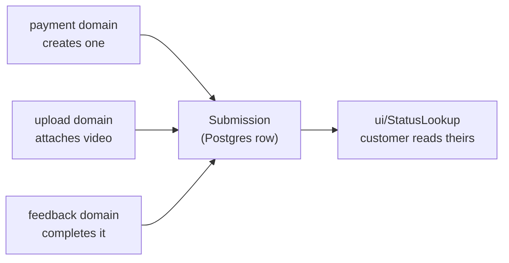

# submission — `src/domains/submission/`

The **submission domain slice** — one folder holding both what a Submission **is** (the noun)
and what a customer **does** with it (looks theirs up). The paid request for video feedback:
the record every other domain orbits.

---

## 1 · The northstar

A submission is **one paid request for one video review**. It is created the moment money
clears, and it accumulates: first the payment, then the video, then the coach's response.
Its `Status` is the whole workflow in one field.

**This slice imports no other domain.** Payment, upload, and feedback all import *it*. That
asymmetry is the architecture: arrows point at the record, and the graph can't cycle.

### The invariants

- **The storage column names live in the Drizzle schema (`shared/db`), and the row↔domain
  mapping lives in `api/submissionRow.ts`.** No other file turns a DB row into a Submission.
  A schema change is a Drizzle migration. *(PRINCIPLES #2.)*
- **Email is normalized to lowercase on write and on lookup**, so a customer who checks out
  as `Alex@x.com` and later looks up `alex@x.com` finds their own submission.
- **One schema validates on both sides.** `model/submissionInput.ts` holds the Zod schemas;
  the client form and the API route use the same objects, so they cannot drift into
  disagreeing about what's acceptable. **The server always re-validates** — client validation
  is a courtesy to honest users, not a boundary.
- **Email is normalized *before* it's validated**, not after. A trailing space from a mobile
  keyboard's autocomplete would otherwise be rejected as an invalid address.
- **`PublicSubmission` is the only shape that leaves the building.** The lookup identifies
  customers by an *unverified* email, so anything on that type is visible to anyone who
  guesses an address. Adding a field to it is a security decision, which is why it lives
  here rather than in the route that serializes it.
- **`status` and `focus` are Postgres enums**, so the DB itself rejects a bad value — no
  runtime guard needed the way the Airtable single-selects required one.
- **The customer-facing flow writes only `awaiting_upload` and `new`.** The other three
  statuses are driven from the operator portal, expressed as `AppWrittenStatus`.

### The pieces

- **the NOUN** — `model/submission.ts` (the type family, `SUBMISSION_STATUSES`,
  `FOCUS_OPTIONS`) · `api/submissionRow.ts` (the row↔domain mapper — the storage seam) ·
  `api/submissionApi.ts` (the Drizzle queries).
- **the VERB** — `ui/StatusLookup.tsx` (email in, your submissions out) ·
  `model/submissionInput.ts` (validating what a customer types before they pay) ·
  `model/publicSubmission.ts` (the trim-to-safe projection).
- `index.ts` — the barrel. Consumers import `@/domains/submission`.

The status lookup lives here rather than in its own domain because *checking your
submissions* is a verb over this noun, not a separate concept. That's PRINCIPLES #4 doing
its job.

---

## 2 · Where we are now — 2026-07-29

- ✅ **On Postgres via Drizzle.** `Submission`, `NewSubmission`, `SubmissionPatch`, the
  `submission_status`/`focus` enums, and the `api/submissionRow.ts` mapper.
- ✅ **The queries** — create, update, get, finders (by payment id, by email, by coach) and
  `listSubmissions` for the admin queue.
- ✅ **The status lookup** — `/status` → `POST /api/status` → sanitized `PublicSubmission`
  list, rate limited. Exposes the row `id` (so the customer can hit their own feedback
  download) and `hasFeedback`, and nothing internal.
- ✅ **Zod schemas**, shared by the form and the route, with per-field errors in the UI.
- 🔶 **The rate limit is per-instance.** Five per minute per IP, held in one serverless
  instance's memory — so a caller spread across instances gets more, and a cold start resets
  the window. It stops a script in a loop, which is the realistic threat here; it does not
  stop a distributed one. Shared state (Upstash Redis) is the honest fix and is a scope
  decision for Ben, since it's a new third-party service. See `shared/lib/rateLimit.ts`.
- ✅ **`assignedCoachId` is a real FK** to `coaches` — set from the admin portal.

---

## 3 · Where we came from

**2026-07-29 · Postgres + storage cutover** ([ADR 007](../../../docs/decisions/007-portal-and-postgres-retire-airtable.md)).
The domain moved off Airtable onto Postgres/Drizzle. The Airtable codec
(`submissionSchema.ts`) and its column-name registry were replaced by a thin
`submissionRow.ts` mapper — the DB schema now owns the names. Status values became a
lowercase Postgres enum; the Mux id columns became `videoUrl`/`feedbackUrl` storage
locators; `Assigned Coach` (text) became `assignedCoachId` (FK). Client components stopped
importing the barrel (which now pulls the Postgres client) and import the model directly.
Everything below is the Airtable era, kept as the trail.

**2026-07-28 · Step 1 — the naming sweep.** Column names used to be bare string literals in
six files, and one concept carried three names: the coaching focus was `focus` in code,
`Sport` in Airtable (holding `"Hitting"`), and `Skill Focus` in the spec. A rename in the
base broke the app silently, in six places. The codec was built to make that impossible.

Decisions taken, with their reasoning:

- **`Sport` → `Focus`.** The column never held a sport. Nobody reading Yuta's base could
  tell what it meant.
- **Kept five focus values, standardized on `Hitting`** over CLAUDE.md's `Batting`. The
  existing data, the coach bios, and the FAQ copy all said Hitting; changing the word would
  have meant migrating rows *and* editing marketing copy to satisfy a spec written before
  either existed. The spec was amended instead.
- **`Notes` split into `Customer Notes` + `Internal Notes`.** One column had been holding
  both what the parent wrote and `[system]` error messages appended by the Mux handler, so
  nothing could be forwarded to a coach without hand-cleaning first. *(PRINCIPLES #2 — one
  home per fact; two facts had been sharing one.)*
- **`Created At` → `Submitted At`, as an Airtable created-time field.** It had been an
  app-written string sitting in an editable cell, and the status lookup sorts on it — one
  stray edit from broken ordering. Now it can't be edited at all.
- **Status 3 → 5.** Without `New` and `Assigned`, Yuta couldn't distinguish "needs a coach"
  from "a coach has it" — which is the queue he actually works from.
- **Column names, not Airtable field IDs.** Field IDs would survive a rename in the UI, but
  `fld7Kd2mQ` is unreadable and IDs differ between the dev and production bases. Chose
  readability plus a single declaration site; the tradeoff is that a rename in Airtable needs
  a matching one-line code change, which OPERATIONS.md warns the client about.
- **`Stripe Session ID` → `Stripe Payment ID`** — named for the *role*, not the Stripe
  object, so the pending Elements rebuild changes what it holds without another migration of
  the client's live base. *(See [ADR 005](../../../docs/decisions/005-stripe-elements-over-checkout.md).)*

**2026-07-28 · Step 3 — Zod and the rate limit.** The hand-rolled validator went; the schema
is now one object both sides import. Writing the check suite caught a bug that would have
shipped: `z.email()` runs *before* a trailing `.transform()`, so trimming there meant
`"alex@x.com "` — what a mobile keyboard produces after autocomplete — was rejected as
invalid. Fixed by normalizing first (`.trim().toLowerCase().pipe(z.email())`), and the
regression is now a named assertion.

React Hook Form came with it, per CLAUDE.md §4's locked stack. It earns its place beyond the
spec: the form previously had no client-side validation at all beyond browser defaults, so
every mistake cost a server round-trip to discover. Fields now show their own errors on blur
— not on keystroke, since flagging a half-typed email is hostile.

**2026-07-28 · Step 2b — the routes got thin.** The status route had been holding the
`PublicSubmission` type and its projection inline. That put "what is safe to show a stranger"
in the app layer, where it read as serialization rather than as the security decision it is.
Moved to `model/publicSubmission.ts`, and the route now calls `lookupPublicSubmissions()`.
The email-validation regex was also duplicated between the route and `submissionInput.ts` —
two copies of one question, free to drift into accepting different things. Now one
`isValidEmail`.

**2026-07-28 · Step 2 — domain-first.** The slice moved here from three separate homes:
`src/types/submission.ts` (the type), `src/integrations/airtable/` (schema + queries), and
`src/lib/submission-input.ts` (validation), with `StatusLookup` lifted out of
`src/app/status/status-form.tsx`. Four folders became one. `AirtableRecord` went the other
way — down to `shared/airtable/`, because the raw record shape is true of any table
(PRINCIPLES #5), and `shared/` importing a domain would have inverted the dependency.
