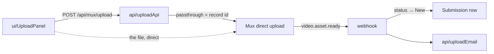

# upload — `src/domains/upload/`

The **upload domain slice** — getting the video to us. All **verb**, and deliberately thin:
the file goes browser → Mux directly and never touches our server.

---

## 1 · The northstar

We don't handle video. We mint **permission** to upload, and we react when Mux says the
asset is ready. That's the whole slice, and keeping it that small is the point — video
storage, transcoding, and streaming are someone else's problem by design.

### The invariants

- **`passthrough` holds the Airtable record ID.** That turns the webhook's lookup into a
  direct fetch by id instead of a formula search — cheaper, no escaping surface, no
  ambiguity about a miss versus a match. *(See [ADR 002](../../../docs/decisions/002-passthrough-holds-record-id.md).)*
- **An upload URL is only ever minted against a Stripe-verified paid session.** The gate
  lives in the route, using the payment domain.
- **The row must exist before the URL is minted** — that's where `passthrough`'s value comes
  from. Don't create Mux uploads outside that path.
- **Wait for `video.asset.ready`, never `video.upload.asset_created`.** An asset isn't
  playable the moment the upload finishes.
- **The received email fires only on the first transition out of `Awaiting Upload`**, so a
  redelivered webhook can't send it twice.
- **System messages go to `Internal Notes`, never `Customer Notes`.** The customer's own
  words stay exactly as they wrote them, so anything forwarded to a coach is clean.

### The pieces

- **the VERB** — `api/uploadApi.ts` (mint the direct upload) ·
  `api/uploadWebhook.ts` (verify Mux's events, move the status, send the email) ·
  `ui/UploadPanel.tsx` (the browser uploader) · `api/uploadEmail.ts` ("your video is in").
- No `model/`: **there is no Upload record.** The upload's facts live on the submission
  (`muxUploadId`, `muxAssetId`, `muxPlaybackId`).

---

## 2 · Where we are now — 2026-07-28

- ✅ **Direct upload**, gated on a paid session, with a one-hour URL timeout.
- ✅ **`video.asset.ready`** → asset and playback ids stored, status → `New`, email sent.
  **Verified against a live base 2026-07-29**, including the idempotency guard: a second
  delivery moves nothing and sends no second email, because the row has already left
  `Awaiting Upload`.
- ✅ **`video.asset.errored`** → status back to `Awaiting Upload` with a `[system]` line in
  `Internal Notes`, so Yuta can spot it and ask for a re-upload.
- 🔶 **Mobile upload is untested on real devices.** CLAUDE.md Sprint 7 flags this as the
  highest-risk part of the whole flow, and it's still unverified — most customers will be
  filming and uploading from a phone.
- 🔶 **No client-side size or duration guidance** beyond the FAQ's "under five minutes."
  Mux validates; the customer finds out late.

---

## 3 · Where we came from

**Before 2026-07-28**, this slice was `lib/mux.ts`, the upload-URL logic inline in
`app/api/mux/upload/route.ts`, and `app/upload/upload-client.tsx`. Step 2 collected them and
lifted the Mux call out of the route handler.

Decisions taken, with their reasoning:

- **`passthrough` = Airtable record ID, not the payment intent ID** (original build,
  superseding CLAUDE.md §7). The spec's version would have required a `filterByFormula`
  search built from external input on every webhook — a table scan plus an escaping surface,
  where a keyed read was available for free. The spec was amended, not the code.
- **Fallback lookup on `Mux Upload ID`** if `passthrough` is ever absent. Belt and braces;
  not observed to trigger.
- **Errored assets return to `Awaiting Upload` rather than a dedicated error status.** The
  customer's next action is identical to someone who never uploaded — try again — so a new
  status would have added a queue state with no distinct handling. The `[system]` note
  carries the detail instead.
- **The whole webhook handler moved out of the route (Step 2b).** This was the fattest route
  in the codebase — 111 lines holding the asset-ready status transition, the errored-asset
  note append, and the passthrough lookup. All of that is what an upload *means*, not HTTP.
  The route is 26 lines now.
- **`UploadClient` renamed `UploadPanel` (Step 2).** "Client" collided with the other
  meaning of the word all over this codebase — Stripe client, Airtable client, the customer.
  One stem per concept.
