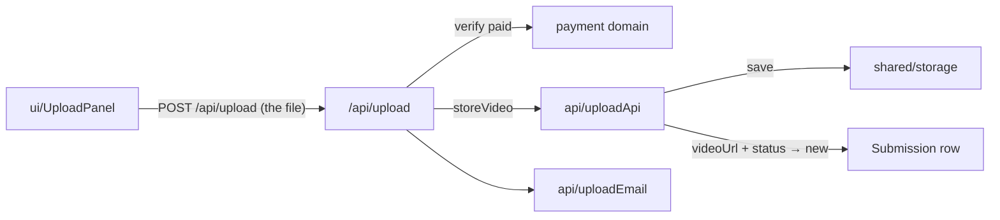

# upload — `src/domains/upload/`

The **upload domain slice** — getting the video to us. All **verb**: the browser sends the
file to our upload route, which streams it to storage and moves the submission forward.

---

## 1 · The northstar

The customer's file comes browser → our route → the `shared/storage` seam (local disk in
dev, Vercel Blob in prod). We save it, record the locator on the submission, and flip the
status to `new`. No transcoding, no streaming — the coach downloads and scrubs locally
([ADR 006](../../../docs/decisions/006-object-storage-over-mux.md)).

### The invariants

- **The file is only stored against a Stripe-verified paid PaymentIntent.** The gate lives in
  the `/api/upload` route, using the payment domain — an unpaid or forged reference stores
  nothing.
- **The storage locator is the submission's `videoUrl`** — a local key in dev, a Blob URL in
  prod. Nothing outside `shared/storage` knows which.
- **The received email fires only on the first upload** (the transition out of
  `awaiting_upload`), so a re-upload can't send it twice.
- **The coach downloads via `/api/video/[id]`, operator-only.** The customer never gets their
  own raw video back; the coach's response comes via `/api/feedback/[id]`.

### The pieces

- **the VERB** — `api/uploadApi.ts` (`storeVideo`: save to storage, move the status) ·
  `ui/UploadPanel.tsx` (the browser file uploader) · `api/uploadEmail.ts` ("your video is
  in"). The HTTP surface is `app/api/upload/route.ts`.
- No `model/`: **there is no Upload record.** The upload's facts live on the submission
  (`videoUrl`, `status`).

---

## 2 · Where we are now — 2026-07-29

- ✅ **Upload → storage**, gated on a verified payment. The file streams to the
  `shared/storage` driver (local disk in dev), the submission gets its `videoUrl` and moves
  to `new`, and the "video received" email fires on the first upload.
- ✅ **Download** — `/api/video/[id]` (operator-only, 401 without a session) streams the file
  back. Verified end to end against the seeded data: a session gets `200 video/mp4`, no
  session gets `401`.
- 🔶 **Mobile upload untested on real devices** — still the highest-risk part of the flow.
- 🔶 **No upload progress bar** — the plain uploader shows "Uploading…", not a percentage —
  and **no client-side size/duration guidance** beyond the FAQ.
- 🔶 **Large files hit the platform body limit on Vercel.** Fine locally; the prod path may
  need a direct-to-Blob client upload or chunking. Flagged for the port.

---

## 3 · Where we came from

**2026-07-29 · Storage cutover** ([ADR 006](../../../docs/decisions/006-object-storage-over-mux.md)).
Mux is gone. The direct-upload + `<MuxUploader>` + `video.asset.ready` webhook were replaced
by a plain uploader that POSTs the file to `/api/upload`, which streams it to the
`shared/storage` seam and moves the status. `passthrough` (ADR 002) is retired — the
submission's own uuid is the link. Everything below is the Mux era, kept as the trail.

**Before 2026-07-28**, this slice was `lib/mux.ts`, the upload-URL logic inline in
`app/api/mux/upload/route.ts`, and `app/upload/upload-client.tsx`. Step 2 collected them and
lifted the Mux call out of the route handler.

Decisions taken, with their reasoning:

- **`passthrough` = Airtable record ID, not the payment intent ID** (original build,
  superseding CLAUDE.md §7). The spec's version would have required a `filterByFormula`
  search built from external input on every webhook — a table scan plus an escaping surface,
  where a keyed read was available for free. The spec was amended, not the code.
- **Fallback lookup on `Mux Upload ID`** if `passthrough` is ever absent. Belt and braces;
  not observed to trigger.
- **Errored assets return to `Awaiting Upload` rather than a dedicated error status.** The
  customer's next action is identical to someone who never uploaded — try again — so a new
  status would have added a queue state with no distinct handling. The `[system]` note
  carries the detail instead.
- **The whole webhook handler moved out of the route (Step 2b).** This was the fattest route
  in the codebase — 111 lines holding the asset-ready status transition, the errored-asset
  note append, and the passthrough lookup. All of that is what an upload *means*, not HTTP.
  The route is 26 lines now.
- **`UploadClient` renamed `UploadPanel` (Step 2).** "Client" collided with the other
  meaning of the word all over this codebase — Stripe client, Airtable client, the customer.
  One stem per concept.
